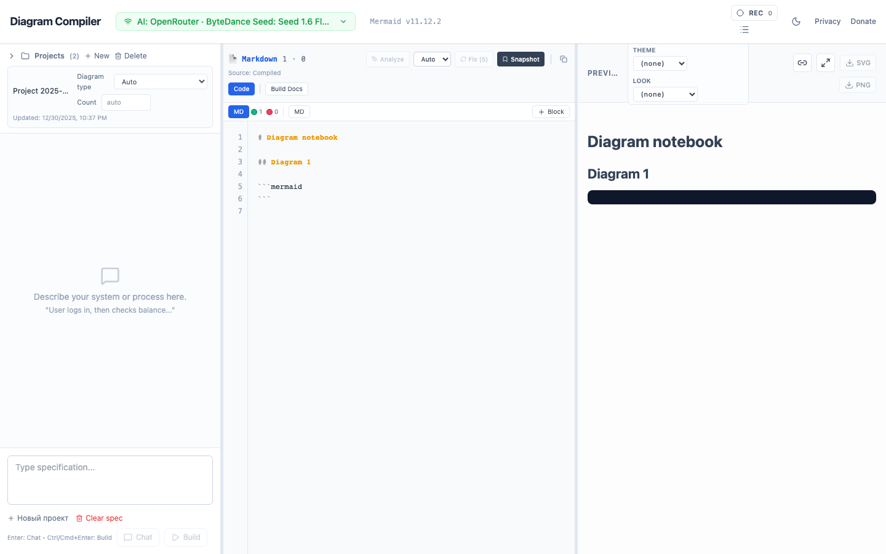
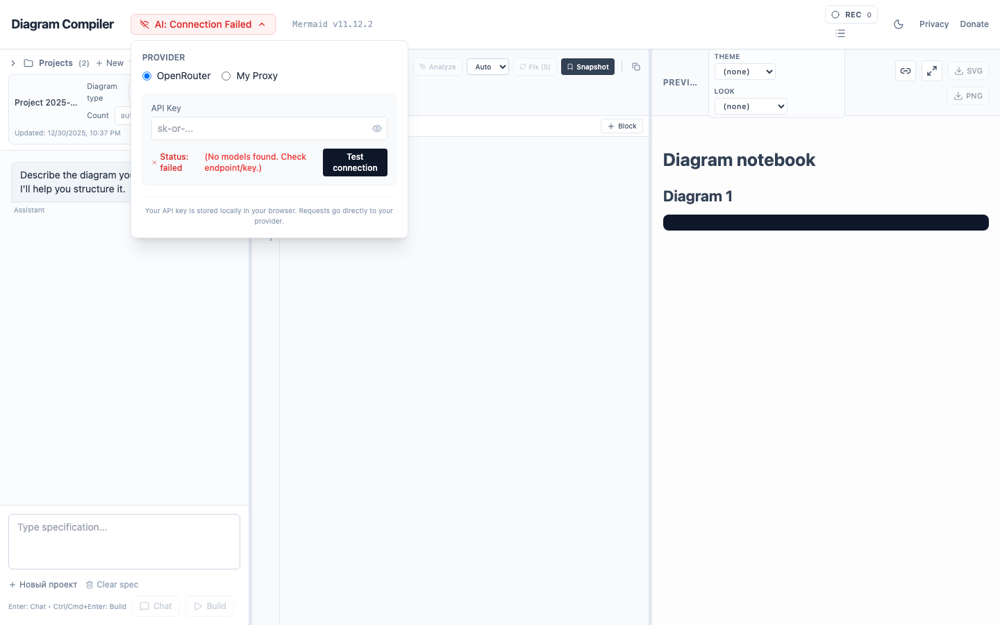
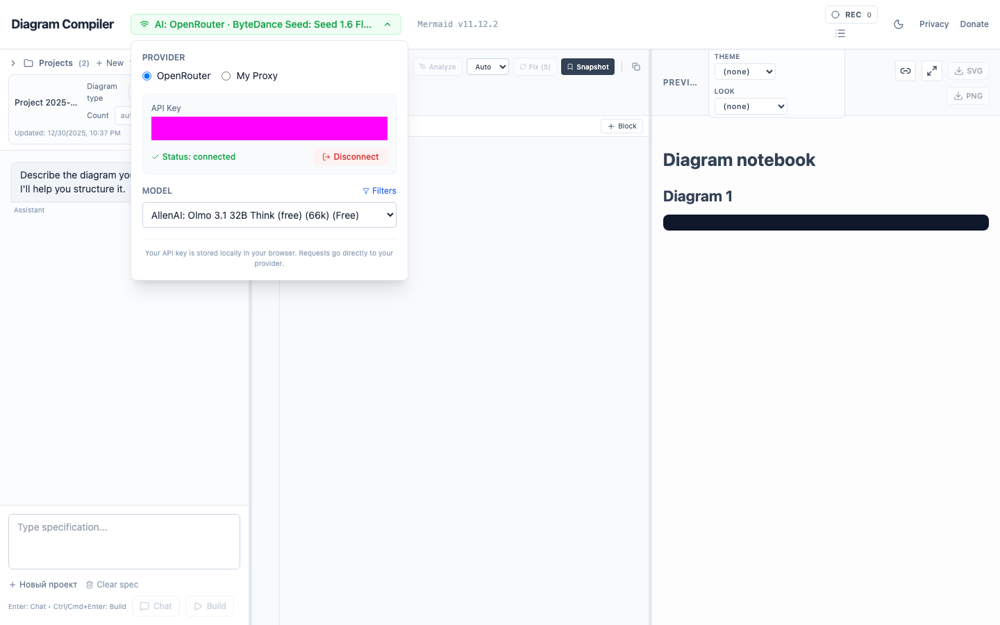
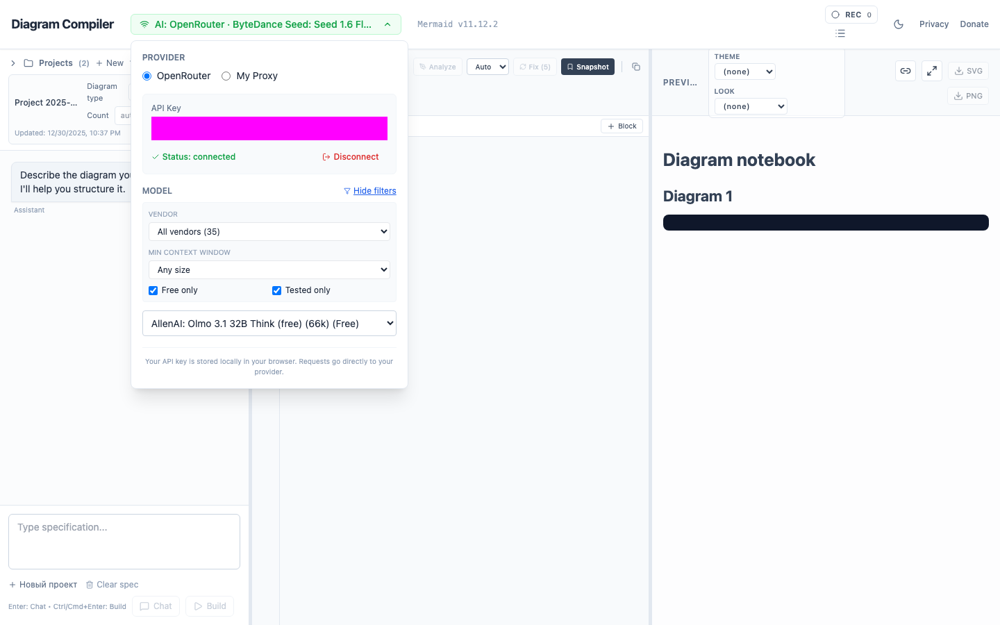
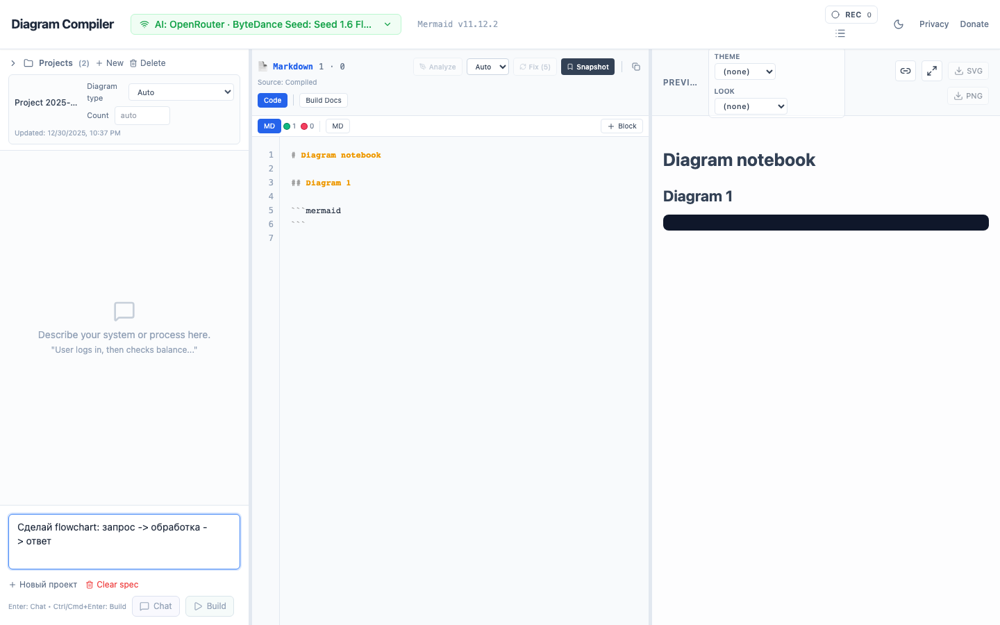
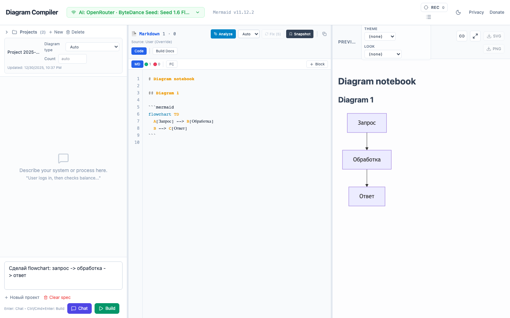

# Mermaid-Compiller: Руководство пользователя

Эта инструкция описывает, как запускать и настраивать проект с точки зрения пользователя, основываясь на документации проекта.

## Что это за проект
`mermaid-compiller` — это фронтенд‑приложение (React + Vite) для работы с диаграммами Mermaid. Оно позволяет:
- генерировать диаграммы из текстовых запросов через LLM (OpenRouter или Cliproxy),
- исправлять ошибки в Mermaid‑коде,
- редактировать код и сразу видеть предпросмотр,
- экспортировать диаграммы (SVG/PNG),
- использовать `@@include` для встраивания `.mmd` файлов при сборке документации.

Важно: это **чистый фронтенд**. Никакого бэкенда. Все вызовы LLM — только по явному действию пользователя.

## Быстрый старт (локально)

1) Установите зависимости:
```bash
npm install
```

2) Запустите dev‑сервер:
```bash
npm run dev
```

3) Откройте приложение в браузере (порт Vite будет указан в консоли).

## Сборка для продакшена

```bash
npm run build
npm run preview
```

Сборка получается в `dist/`. Для деплоя достаточно статического хостинга (S3/Netlify/Cloudflare Pages).

## Настройка LLM (OpenRouter / Cliproxy)

Конфигурация LLM берётся из переменных окружения через Vite.

Пример `.env`:
```env
VITE_LLM_PROVIDER=openrouter
VITE_OPENROUTER_ENDPOINT=https://openrouter.ai/api/v1
VITE_PROXY_ENDPOINT=http://localhost:8317
VITE_OPENROUTER_KEY=ваш_ключ
```

Что означает:
- `VITE_LLM_PROVIDER`: выбранный провайдер (`openrouter` или `cliproxy`).
- `VITE_OPENROUTER_ENDPOINT`: URL OpenRouter API (обычно `https://openrouter.ai/api/v1`).
- `VITE_PROXY_ENDPOINT`: локальный прокси для работы с локальными моделями или кастомным API.
- `VITE_OPENROUTER_KEY`: ключ OpenRouter (не хранить в репозитории).

Ключи не хранятся в коде — только в переменных окружения. Вызовы к LLM происходят только при нажатии «Построить» или «Исправить».

## Режимы работы в приложении

- **Generate / Build**: генерация Mermaid‑кода из текстового запроса.
- **Fix**: исправление синтаксических ошибок в Mermaid‑коде.
- **Chat**: уточнение требований в формате intent.
- **Analyze**: объяснение существующего Mermaid‑кода.

## Работа с документацией и @@include

Проект поддерживает синтаксис `@@include('path/to/file.mmd')`.
- В редакторе это выглядит как обычный текст.
- На этапе сборки Vite‑плагин `IncludesPlugin` подставляет содержимое `.mmd` файлов.

Пример:
```md
@@include('diagrams/auth.mmd')
```

## Экспорт диаграмм

Экспорт в SVG/PNG выполняется прямо в браузере:
- SVG берётся из рендера Mermaid.
- Для PNG используется canvas (рендер SVG в bitmap).

## Типовые сценарии

## Пошаговый флоу (от настройки модели до диаграммы)

1) Откройте приложение и убедитесь, что создан новый проект.


2) Нажмите на статус AI в верхней панели, чтобы открыть настройки провайдера.

3) До ввода ключа статус будет красным (соединение не установлено).


4) Выберите провайдера (OpenRouter или My Proxy) и введите API‑ключ, затем нажмите «Test connection».


5) Откройте фильтры моделей и задайте параметры:
   - вендор (например, xiaomi),
   - минимальный контекст (например, 128k+),
   - бесплатные модели (Free only).


6) В выпадающем списке модели выберите подходящую модель.

7) Закройте панель настроек и перейдите в поле спецификации слева.

8) Введите текстовый запрос (например: «Сделай flowchart: запрос -> обработка -> ответ»).


9) Нажмите «Build», чтобы сгенерировать Mermaid‑код.

10) Проверьте результат в редакторе и в превью справа.


11) При необходимости:
   - исправьте код вручную в редакторе,
   - нажмите «Fix» для автоматической правки,
   - используйте «Analyze» для объяснения диаграммы,
   - экспортируйте через SVG/PNG.

### 1. Генерация диаграммы
1) Введите текстовый запрос.
2) Нажмите «Построить».
3) Получите Mermaid‑код и предпросмотр.

### 2. Исправление ошибки
1) Вставьте Mermaid‑код с ошибкой.
2) Нажмите «Исправить».
3) Система запросит LLM, применит правку и перерендерит диаграмму.

### 3. Встраивание в документацию
1) Сохраните диаграмму как `.mmd` файл.
2) В Markdown вставьте `@@include('...')`.
3) При сборке VitePress диаграмма встраивается автоматически.

## Частые проблемы

- **LLM не отвечает**: проверьте ключ и эндпоинт, интернет, лимиты провайдера.
- **Нет результатов**: убедитесь, что запрос понятен, и попробуйте другой режим (chat/fix).
- **Данные не сохраняются**: хранение проектов в браузере (IndexedDB). Очистка данных браузера удалит историю.

## Полезные команды

```bash
npm install
npm run dev
npm run build
npm run preview
```

---

Если нужно, могу добавить в это руководство разделы по конкретным API‑эндпоинтам или сценариям интеграции.
