# Diagram notebook

Это обычный Markdown файл с несколькими Mermaid-блоками.  
В приложении можно вставить содержимое целиком в Editor, выбрать нужный блок вкладками (`Mermaid 1`, `Mermaid 2`, …) и делать `Chat`/`Build` для каждого блока отдельно.

Ниже — подробное «описание проекта через схемы». Диаграммы намеренно избыточны: их удобно по одной улучшать через чат (`Analyze/Chat/Build`) и смотреть, как меняется архитектурная «карта».

---

## Diagram 1 — Структура репозитория (high-level)

Зачем: быстро понять «что где лежит» и какие части связаны между собой.

Как читать:
- `diagram-compiler/` — основное SPA приложение.
- `public/mermaid-docs/` — подмножество Mermaid-доков для контекста LLM.
- `mermaid-docs/` в корне — полный снапшот доков (версия фиксируется в `diagram-compiler/constants.ts`).
- `server.js` обслуживает собранный `diagram-compiler/dist`.

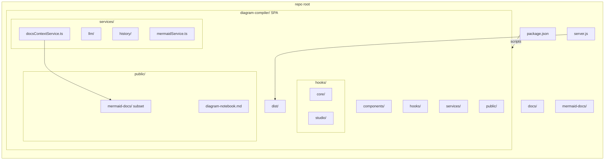

---

## Diagram 2 — Архитектура SPA (UI → hooks → services)

Зачем: увидеть слои приложения и «центральную точку» оркестрации.

Как читать:
- UI-компоненты (колонки) не держат бизнес-логику — они дергают хуки.
- `useDiagramStudio` — главный оркестратор (собирает состояние, вызывает сервисы, прокидывает данные в preview).
- Сервисы отделяют интеграции: LLM, Mermaid parse/render, docs context, история, экспорт.
- `localStorage` — только настройки/ключи; история и ревизии — в `IndexedDB`.

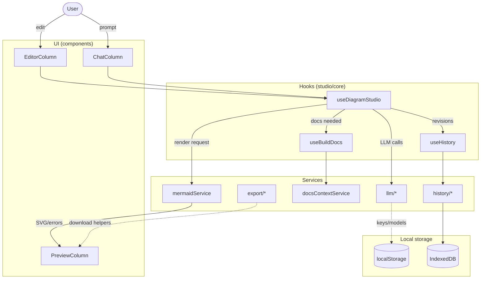

---

## Diagram 3 — Пайплайн Build (sequence)

Зачем: пошагово проследить, что происходит при нажатии `Build` — от клика до превью и сохранения ревизии.

Ключевые моменты:
- Контекст документации подмешивается опционально (в зависимости от режима/переключателя).
- Валидация Mermaid обязательна: `parse`/`autoFix` → либо SVG, либо диагностическое сообщение.
- Ревизия сохраняется всегда (и для валидного результата, и для ошибки) — чтобы можно было воспроизвести состояние.

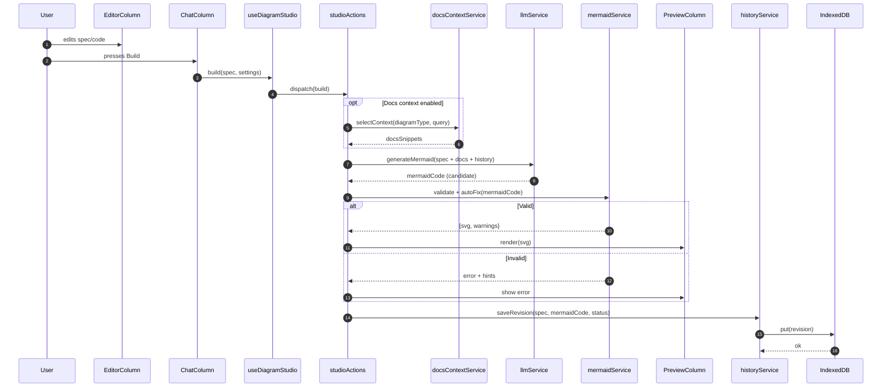

---

## Diagram 4 — Чат (Analyze → Chat → Build) и намерения

Зачем: различать режимы общения с моделью и понимать, почему кнопки/поток действий отличаются.

Как читать:
- `Analyze` — структурирует проблему/требования, не обязан генерировать Mermaid-код.
- `Chat` — объясняет/уточняет/предлагает варианты.
- `Build/Fix` — формирует промпт с контекстом, генерирует кандидата Mermaid и прогоняет валидацию/исправления.

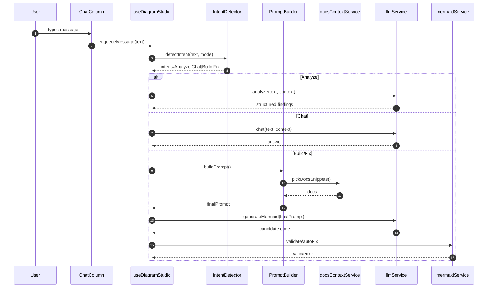

---

## Diagram 5 — Жизненный цикл диаграммы (state machine)

Зачем: понимать состояния, в которых может быть диаграмма, и почему UI иногда «не дает» нажимать кнопки (например, во время `Building`).

Подсказки:
- `Dirty` означает «есть несохраненные изменения относительно последнего compiled/valid».
- `Invalid` не тупик: `Fixing` возвращает в `Candidate`.
- `Exporting` — отдельная ветка, не меняет содержимое диаграммы.

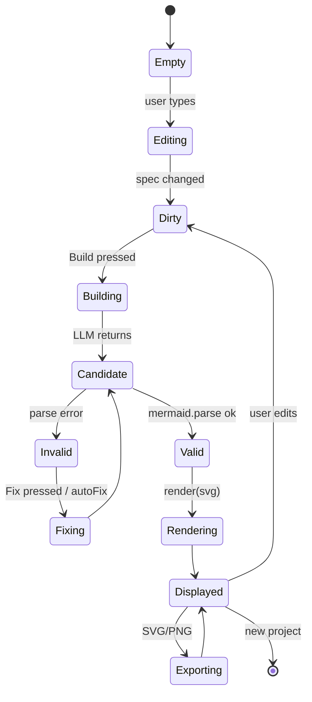

---

## Diagram 6 — История и ревизии (пример ER-модели)

Зачем: понять, какие сущности удобно хранить в `IndexedDB`, чтобы поддерживать историю, восстановление, маркеры ошибок и контекст чата.

Как читать:
- `SESSION` группирует одну «работу» пользователя (проект/сессию).
- `REVISION` — основной атом истории (spec + mermaidCode + статус).
- `MESSAGE` — сообщения чата, привязанные к ревизии (полезно для «почему так получилось»).
- `MARKER` — структурированные ошибки/подсказки (line/column) для подсветки и навигации.

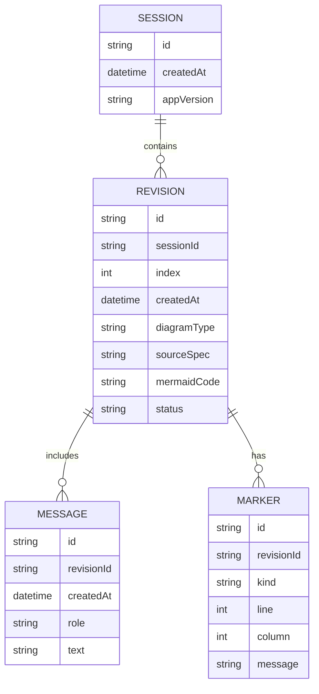

---

## Diagram 7 — Build Docs / контекст документации

Зачем: показать, как подмешивается контекст Mermaid-документации в запрос к LLM.

Как читать:
- Источник может быть «легким» (subset в `public/mermaid-docs`) или «полным» (snapshot в `mermaid-docs/<version>`).
- Важно не «скормить все»: сначала ранжирование, затем упаковка в контекстное окно (chunking/limit).
- Результат идет в `PromptBuilder`, затем в `llmService`.

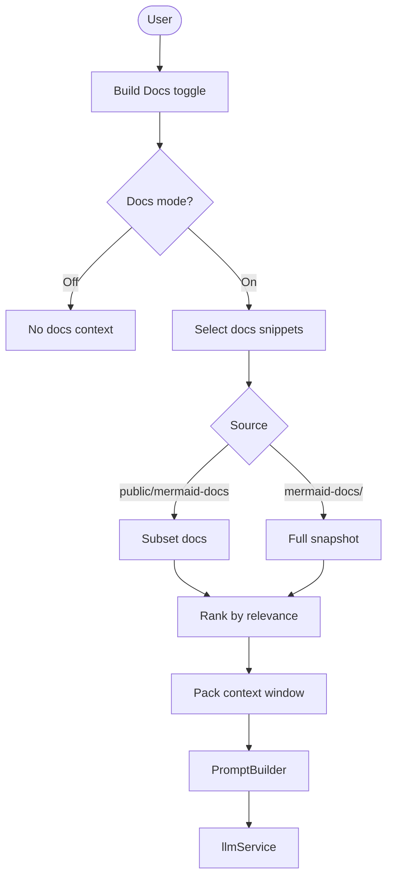

---

## Diagram 8 — Рендер/превью/зум/экспорт

Зачем: отделить «валидность кода» от «отрисовки» и понять, где появляются ошибки и где работают кнопки зума/экспорта.

Советы:
- Если `parse` падает — экспорта/зума быть не должно (нет SVG).
- `render` → SVG → вставка в DOM → затем панорама/зум/fit и только потом экспорт.
- Экспорт SVG обычно проще (сериализация), PNG требует растеризации.

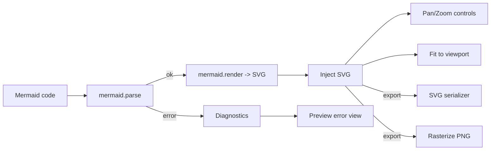

---

## Diagram 9 — LLM Provider Strategy (class)

Зачем: объяснить, как приложение переключает провайдеров (локальный прокси/облако) без переписывания логики UI.

Как читать:
- `LLMService` держит активную стратегию (`LLMProviderStrategy`) и вызывает общий интерфейс.
- Стратегии инкапсулируют детали API (эндпоинты, заголовки, формат сообщений, модели).
- `MockStrategy` полезна для тестов и офлайн-режима.

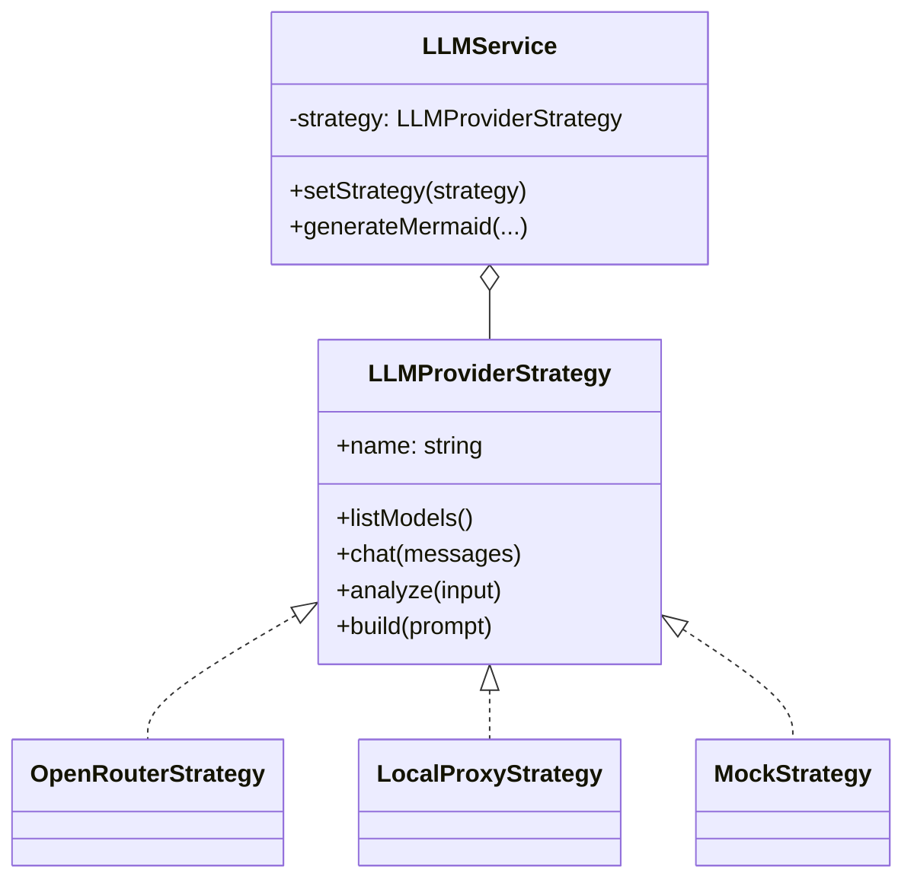

---

## Diagram 10 — Где что хранится (privacy/storage)

Зачем: зафиксировать правило приватности: ключи остаются у пользователя, история живет локально.

Как читать:
- `localStorage` — настройки (провайдер/модель/тема/язык/ключи).
- `IndexedDB` — тяжелые данные: сессии, ревизии, сообщения.
- Внешним провайдерам отправляется только то, что нужно для запроса (и только вместе с ключом из настроек).

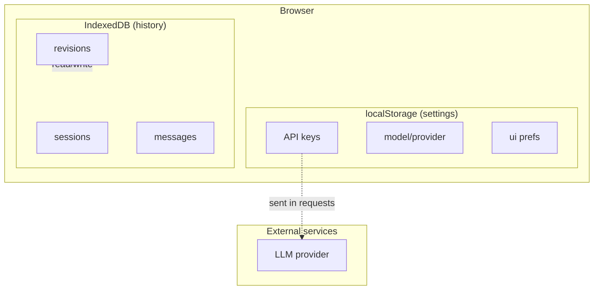

---

## Diagram 11 — Запись взаимодействий (interactions log)

Зачем: понять механику трекинга действий (клики/ввод) и «снимков» состояния для дебага/воспроизведения сессии.

Как читать:
- Recorder пишет события в in-memory лог (в рамках одной сессии).
- Snapshot (если включен) добавляет периодические/ручные снимки UI состояния.
- Просмотр лога — это просто read из накопленного буфера.

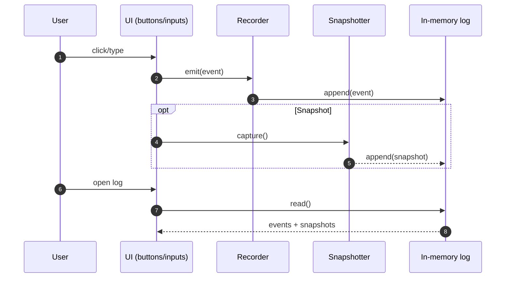

---

## Diagram 12 — C4-стиль: контекст системы (очень упрощённо)

Зачем: «вид сверху» — кто пользователи, что внутри SPA, какие внешние зависимости.

Как читать:
- Внутри браузера: UI + engine + Mermaid validate/render + история + docs context.
- Снаружи: LLM провайдеры (облако/локальный прокси).
- Потоки: пользователь → UI → engine → (валидация/история/доки/LLM) → обратно в UI.

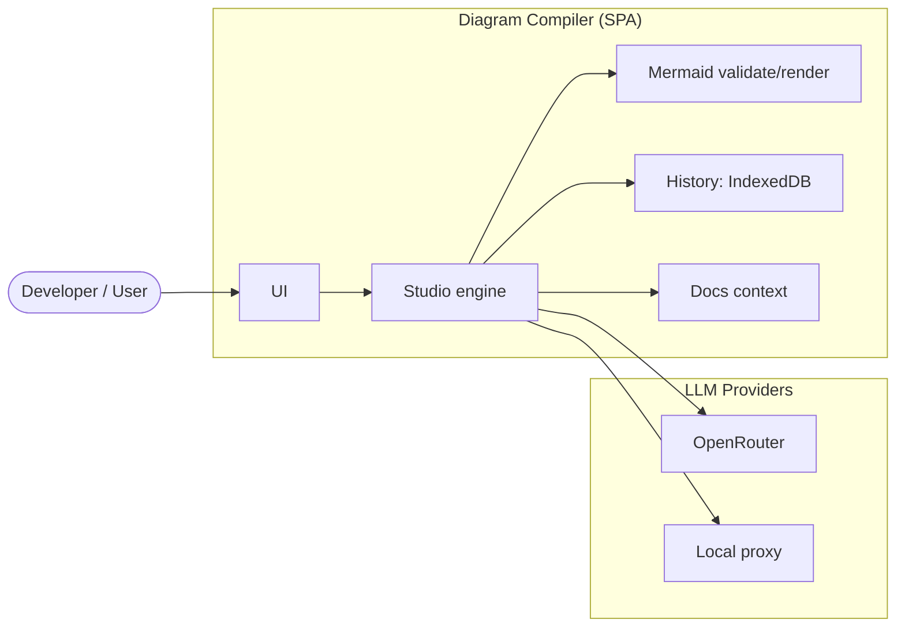
