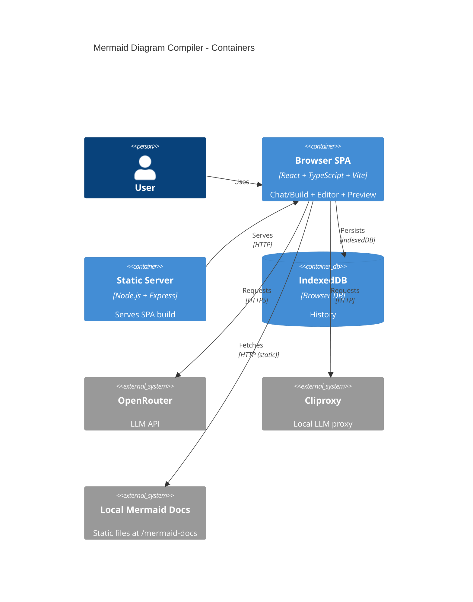

# C4 L2 — Containers

## Контейнеры

- **Browser SPA**: `diagram-compiler/` — основной UI (Chat/Editor/Preview), хуки/сервисы.
- **Static file server (prod)**: `server.js` — раздаёт `diagram-compiler/dist`.
- **Static Mermaid docs**: `diagram-compiler/public/mermaid-docs` — локальные сниппеты документации для промптов.

## Диаграмма контейнеров (C4Container)

---

Обновлено: 2025-12-24. Согласовано с текущей реализацией (markdown-навигация, scroll sync, frontmatter config).
