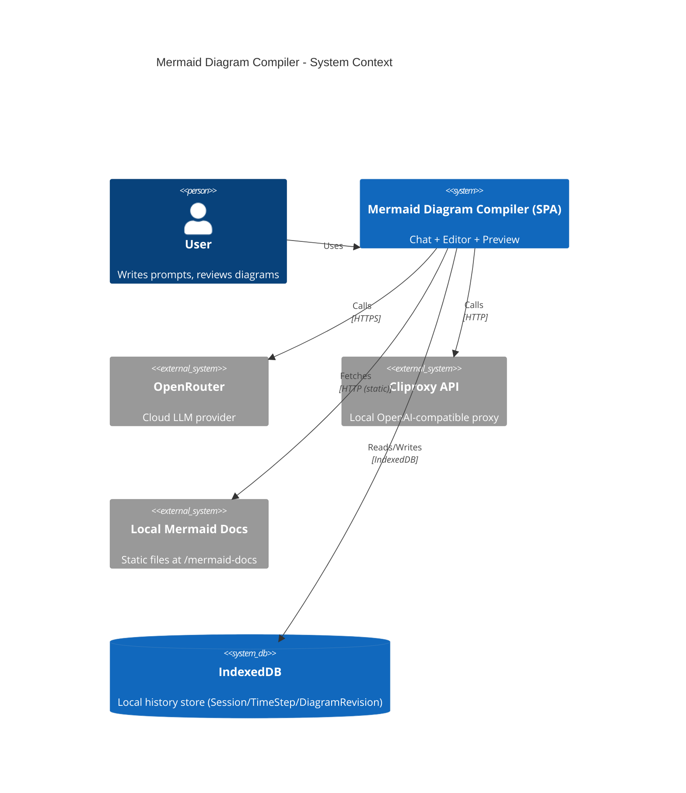

# C4 L1 — System Context

## Что это за система

**Mermaid Diagram Compiler** — локальное SPA (React/Vite), которое помогает:
- вести диалог (Chat) по требованиям к диаграмме,
- генерировать/обновлять Mermaid-код (Build),
- валидировать и чинить синтаксис (Auto-fix/Fix),
- хранить историю шагов и ревизий диаграмм локально в браузере (IndexedDB).

## Диаграмма контекста (C4Context)

> Mermaid C4 — экспериментальный тип диаграмм; некоторые Markdown-превьюеры могут не поддерживать его. Если превью пустое, открой диаграмму в приложении или в Mermaid Live Editor.

Примечания:
- В режиме **Chat** приложение просит LLM отвечать **только текстом**.
- В режиме **Build** приложение просит LLM вернуть **только Mermaid-код** и валидирует его через `mermaid.parse()`.
