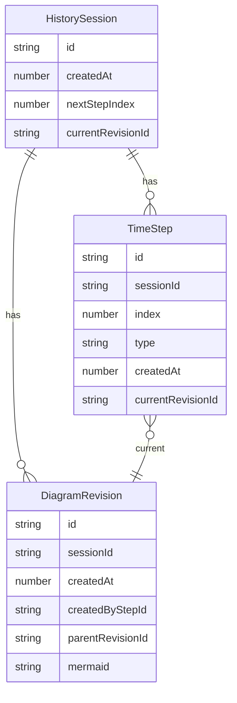

# Data model — History (IndexedDB)

## Цель

Хранить локально:
- историю действий пользователя/ИИ (TimeStep),
- ревизии Mermaid-кода (DiagramRevision),
- возможность навигации по «рендерам диаграммы» из чата.

## Сущности

- **Session** — активная сессия пользователя.
- **TimeStep** — шаг истории на каждое действие (chat/build/fix/analyze/recompile/manual_edit...).
- **DiagramRevision** — создаётся только когда меняется Mermaid-код.

## Правило «одна диаграмма на шаг»

Каждый `TimeStep` содержит `currentRevisionId`:
- если шаг меняет диаграмму — указывает на новую ревизию,
- если шаг не меняет диаграмму (например, `chat`) — копирует `currentRevisionId` предыдущего шага,
- если диаграмма очищена — `currentRevisionId = null`.

## Схема (упрощённо)

