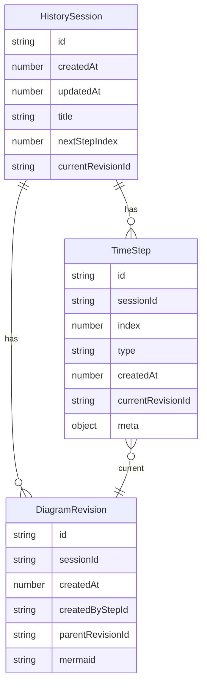

# Data model — History (IndexedDB)

## Цель

Хранить локально:
- историю действий пользователя/ИИ (TimeStep),
- ревизии Mermaid-кода (DiagramRevision),
- возможность навигации по «рендерам диаграммы» из чата.

## Сущности

- **Session** — активная сессия пользователя.
- **TimeStep** — шаг истории на каждое действие (chat/build/fix/analyze/recompile/manual_edit...).
- **DiagramRevision** — создаётся только когда меняется Mermaid-код.

## Правило «одна диаграмма на шаг»

Каждый `TimeStep` содержит `currentRevisionId`:
- если шаг меняет диаграмму — указывает на новую ревизию,
- если шаг не меняет диаграмму (например, `chat`) — копирует `currentRevisionId` предыдущего шага,
- в режиме notebook шаги `build` содержат метаданные блока (`blockIndex`, `diagramType`, `success`).
- если диаграмма очищена — `currentRevisionId = null`.

## Схема (упрощённо)

```mermaid
erDiagram
  HistorySession ||--o{ TimeStep : has
  HistorySession ||--o{ DiagramRevision : has
  TimeStep }o--|| DiagramRevision : current

  HistorySession {
    string id
    number createdAt
    number updatedAt
    string title
    number nextStepIndex
    string currentRevisionId
  }

  TimeStep {
    string id
    string sessionId
    number index
    string type
    number createdAt
    string currentRevisionId
    object meta
  }

  DiagramRevision {
    string id
    string sessionId
    number createdAt
    string createdByStepId
    string parentRevisionId
    string mermaid
  }
```

## meta (TimeStep)

`TimeStep.meta` хранит UI/операционные данные шага (не влияющие на Mermaid-код), например:
- `operationLog` — события операции, тайминги, контекст (messages/docs/system prompt) для тултипов.
- `autoTitle` — авто-имя проекта, извлеченное из первого Chat и примененное к `HistorySession.title`.
- notebook-build поля: `blockIndex`, `diagramType`, `success`.

---

Обновлено: 2026-01-22. Согласовано с текущей реализацией (UI-косметика, модель данных без изменений).
