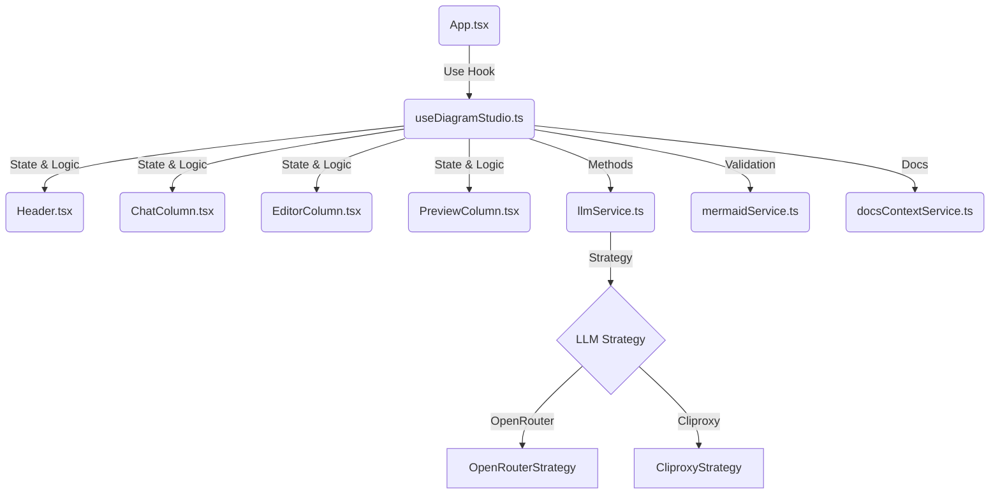

# План Реализации: Генератор Диаграмм Mermaid (v2.0 - React/Vite)

## 1. Обзор Архитектуры

Система представляет собой одностраничное приложение (SPA) на базе React и TypeScript, собранное с помощью Vite.
Архитектура была переработана для улучшения разделения ответственности: вся бизнес-логика и управление состоянием вынесены в кастомный хук `useDiagramStudio`, а `App.tsx` отвечает только за композицию UI.

## 2. Технический Стек

*   **Фронтенд:**
    *   **Framework:** React 19 + TypeScript.
    *   **Build Tool:** Vite.
    *   **Styling:** Tailwind CSS (Dark Mode support).
    *   **Icons:** Lucide React.
    *   **Editor:** `react-simple-code-editor` + `prismjs` (One Dark theme).
    *   **Diagramming:** Mermaid.js (npm package).
*   **Архитектура:**
    *   **State Management:** Custom Hook (`useDiagramStudio`) + `useState` + `localStorage`.
    *   **LLM Integration:** Strategy Pattern (`OpenRouterStrategy`, `CliproxyStrategy`).

## 3. Структура Проекта (`diagram-compiler/src/`)

### 3.1. Компоненты (`components/`)
*   **`Header.tsx`:** Настройки подключения, выбор провайдера, переключение темы (Dark/Light).
*   **`ChatColumn.tsx`:** Чат с ИИ. Отображение истории, ввод промптов, выбор типа диаграммы.
*   **`EditorColumn.tsx`:** Редактор кода Mermaid с подсветкой синтаксиса, панель инструментов (Language, Analyze, Fix, Run).
*   **`PreviewColumn.tsx`:** Рендеринг SVG диаграммы.

### 3.2. Хуки (`hooks/`)
*   **`useDiagramStudio.ts`:**
    *   Центральный контроллер приложения.
    *   Управление состоянием (`aiConfig`, `connection`, `mermaidCode`, `appState`).
    *   Логика чата (`handleSendMessage`), компиляции (`handleRecompile`), анализа (`handleAnalyze`).
    *   Авто-подключение и восстановление сессии.
    *   Управление темой и языком.

### 3.3. Сервисы (`services/`)
*   **`llmService.ts`:** Фасад для работы с LLM. Делегирует вызовы стратегиям.
    *   `llm/OpenRouterStrategy.ts`: Реализация для OpenRouter.
    *   `llm/CliproxyStrategy.ts`: Реализация для локального прокси.
*   **`mermaidService.ts`:** Валидация кода, инициализация Mermaid, парсинг ответов.
*   **`docsContextService.ts`:** Загрузка локальной документации (параллельная).

## 4. Основные Процессы

### 4.1. Интеллектуальный Чат
1.  Пользователь отправляет сообщение.
2.  Система определяет язык пользователя (или использует выбранный).
3.  Загружается контекст документации.
4.  Отправляется запрос в LLM (режим `chat`): "Проанализируй, построй диаграмму или задай вопрос".
5.  Если ответ содержит код Mermaid -> обновляется редактор и превью.
6.  Ответ ИИ (текст) добавляется в чат (код вырезается из текста сообщения для чистоты).

### 4.2. Анализ и Исправление
*   **Analyze:** Отправляет текущий код диаграммы в LLM с просьбой объяснить структуру.
*   **Fix Syntax:** Отправляет код и текст ошибки валидации в LLM для исправления.

### 4.3. Настройки и Персонализация
*   **Dark Mode:** Переключение тем (синхронизация с Mermaid theme и редактором кода).
*   **Language:** Выбор языка общения с ИИ (Auto/EN/RU).
*   **Auto-Connect:** Приложение автоматически подключается при старте, если сохранены ключи.

## 5. Запуск

*   `npm install`
*   `npm run dev`