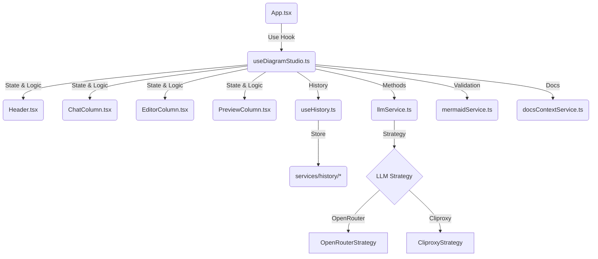

# План Реализации: Генератор Диаграмм Mermaid (v2.0 - React/Vite)

## 1. Обзор Архитектуры

Система представляет собой одностраничное приложение (SPA) на базе React и TypeScript, собранное с помощью Vite.
Архитектура была переработана для улучшения разделения ответственности: вся бизнес-логика и управление состоянием вынесены в кастомный хук `useDiagramStudio`, а `App.tsx` отвечает только за композицию UI.

## 2. Технический Стек

*   **Фронтенд:**
    *   **Framework:** React 19 + TypeScript.
    *   **Build Tool:** Vite.
    *   **Styling:** Tailwind CSS (Dark Mode support).
    *   **Icons:** Lucide React.
    *   **Editor:** `react-simple-code-editor` + `prismjs` (One Dark theme).
    *   **Diagramming:** Mermaid.js (npm package).
*   **Архитектура:**
    *   **State Management:** Custom Hook (`useDiagramStudio`) + `useState`; настройки в `localStorage`, история в IndexedDB.
    *   **LLM Integration:** Strategy Pattern (`OpenRouterStrategy`, `CliproxyStrategy`).

## 3. Структура Проекта (`diagram-compiler/src/`)

### 3.1. Компоненты (`components/`)
*   **`Header.tsx`:** Настройки подключения, выбор провайдера, переключение темы (Dark/Light).
*   **`ChatColumn.tsx`:** Чат с ИИ. Отображение истории, ввод промптов, выбор типа диаграммы.
*   **`EditorColumn.tsx`:** Редактор кода Mermaid с подсветкой синтаксиса, панель инструментов (Analyze, язык анализа, Fix, Snapshot, Copy), вкладки Prompt/Build Docs.
*   **`PreviewColumn.tsx`:** Рендеринг SVG диаграммы.

### 3.2. Хуки (`hooks/`)
*   **`useDiagramStudio.ts`:**
    *   Центральный контроллер приложения.
    *   Управление состоянием (`aiConfig`, `connection`, `mermaidCode`, `appState`).
    *   Логика чата (`handleSendMessage`), компиляции (`handleRecompile`), анализа (`handleAnalyze`).
    *   Авто-подключение и восстановление сессии.
    *   Управление темой и языком.
*   **`useHistory.ts`:**
    *   Работа с историей (Session/TimeStep/DiagramRevision).
    *   Восстановление состояния при старте.
    *   Метки ревизий для навигации из чата.

### 3.3. Сервисы (`services/`)
*   **`llmService.ts`:** Фасад для работы с LLM. Делегирует вызовы стратегиям.
    *   `llm/OpenRouterStrategy.ts`: Реализация для OpenRouter.
    *   `llm/CliproxyStrategy.ts`: Реализация для локального прокси.
*   **`mermaidService.ts`:** Валидация кода, инициализация Mermaid, парсинг ответов.
*   **`docsContextService.ts`:** Загрузка локальной документации (параллельная).
*   **`services/history/*`:** Хранилище истории (IndexedDB) для шагов и ревизий.

## 4. Основные Процессы

### 4.1. Два режима: Chat и Build (Intent → Mermaid)

Ключевая идея UX и архитектуры: **Chat** отвечает за прояснение требований и фиксацию намерения (intent), а **Build** — за получение **валидного Mermaid-кода** с обязательной проверкой (`mermaid.parse()`).

#### 4.1.1. Chat (обсуждение / intent)
1.  Пользователь отправляет сообщение (идея/изменение/уточнение).
2.  Система определяет язык пользователя (или использует выбранный).
3.  Вызывается LLM в режиме `chat` с **маленьким контекстом** и короткими ответами.
4.  Результат Chat-фазы — **структурированный intent**, а не Mermaid-код:
    * требования (что изображаем),
    * ограничения,
    * выбранный тип диаграммы,
    * допущения/вопросы (если нужны).
5.  Ответ ИИ добавляется в чат; Mermaid-код из текста (если встречается) не применяется к редактору.

#### 4.1.2. Build (сборка / компиляция)
1.  Триггер: кнопка **Build** (возможно без нового промпта, используя последний intent + контекст чата).
2.  Формируется компактный, но точный контекст: intent + текущий Mermaid (если есть) + релевантные правила/фрагменты локальной документации.
3.  Вызывается LLM в режиме `generateDiagram` со **строгими инструкциями** (минимум “болтовни”, низкая температура, `max_tokens` с запасом).
4.  Ответ проходит извлечение Mermaid (`extractMermaidCode`) и **обязательную валидацию** (`mermaid.parse()`).
5.  Успех: обновляются `EditorColumn` и `PreviewColumn`, создаётся новая `DiagramRevision`.
6.  Ошибка: Build “честно падает” с сообщением парсера и (опционально) запускает авто-цикл исправления (Fix Loop) до N попыток.

#### 4.1.3. Профили моделей (особенно для free-tier)
* Chat: маленький контекст/`max_tokens`, допускаются слабые/бесплатные модели.
* Build: контекст минимальный, но точный; низкая температура; валидация обязательна.
* Разделение режимов экономит контекст и повышает стабильность на бесплатных моделях.

### 4.2. Анализ и Исправление
*   **Analyze:** Отправляет текущий код диаграммы в LLM с просьбой объяснить структуру.
*   **Fix Syntax:** Отправляет код и текст ошибки валидации в LLM для исправления.

### 4.3. Настройки и Персонализация
*   **Dark Mode:** Переключение тем (синхронизация с Mermaid theme и редактором кода).
*   **Language:** Выбор языка общения с ИИ (Auto/EN/RU).
*   **Auto-Connect:** Приложение автоматически подключается при старте, если сохранены ключи.

### 4.4. Полный список типов диаграмм
*   Типы диаграмм синхронизируются с документацией Mermaid (v11.12.2).
*   UI селектор показывает все доступные типы из документации.
*   Контекст документации загружается по выбранному типу.

### 4.5. Управление контекстом Build
*   При смене типа диаграммы загружаются все файлы, используемые в Build-промпте (тип + общие).
*   В отдельной вкладке Build Docs отображаются табы файлов с чекбоксами включения/исключения.

### 4.6. Превью Markdown
*   Если в редакторе Markdown, превью рендерит текст и Mermaid-блоки.
*   Во втором окне появляются вкладки для каждого Mermaid-блока из Markdown.
*   Невалидные Mermaid-блоки в Markdown заменяются inline-ошибкой на месте блока.

### 4.7. Экспорт диаграммы
*   Кнопки в превью: **SVG** и **PNG**.
*   SVG: прямое сохранение клонированного `svg`.
*   PNG: инлайнит внешние изображения/CSS ресурсы, проверяет наличие `foreignObject`; при проблемах показывает ошибку и предлагает экспортировать SVG.
*   Фон PNG совпадает с текущей темой (темная/светлая).

### 4.8. Прозрачность промптов
*   В редакторе/превью есть вкладки Prompt · Chat / Prompt · Build / Prompt · Analyze / Prompt · Fix.
*   Отображается собранный системный промпт, список файлов документации и список сообщений, плюс оценка токенов (system/messages/total).
*   Превью обновляется по мере изменений ввода, истории и типа диаграммы.

## 5. Запуск

*   `npm install`
*   `npm run dev`
