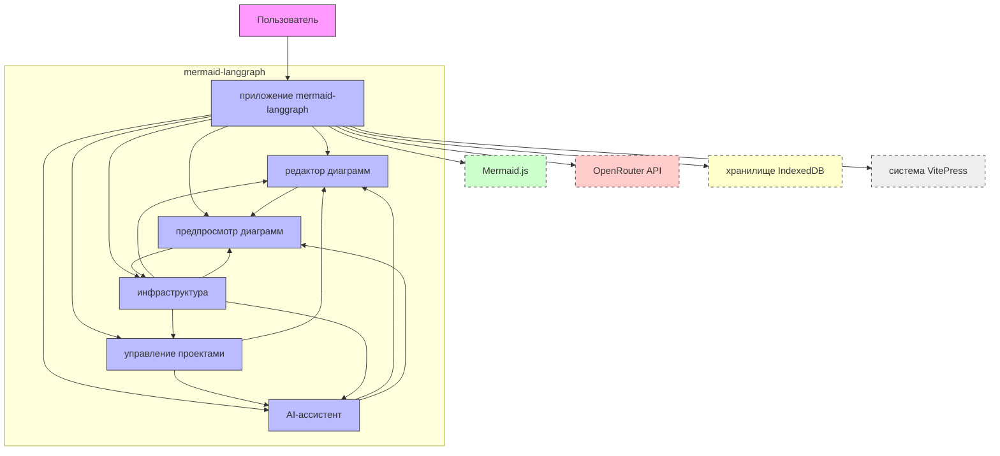

# System Context Overview

## 1. Project Introduction

**Project Name**: `mermaid-langgraph`  
**Generation Time**: 2025-12-30 16:35:42 (UTC)  
**Timestamp**: 1767112542

`mermaid-langgraph` — это интерактивная веб-платформа, предназначенная для создания, редактирования, визуализации и документирования диаграмм Mermaid с интеграцией искусственного интеллекта. Платформа представляет собой фронтенд-приложение, построенное на базе React и Vite, и ориентирована на повышение продуктивности разработчиков, архитекторов и технических писателей при работе с архитектурными диаграммами.

### Core Functionality
Платформа объединяет в себе четыре ключевых функциональных модуля:
- **Редактор кода** — с подсветкой синтаксиса Mermaid, поддержкой Markdown-блоков и командами вставки (темы, направления, метаданные).
- **Живой предпросмотр** — мгновенный рендеринг диаграмм через Mermaid.js с полной синхронизацией кода и визуализации, включая скроллинг по соответствующим строкам.
- **ИИ-ассистент** — чат-бот на основе LLM (например, через OpenRouter API), способный генерировать диаграммы по текстовому описанию, автоматически исправлять синтаксические ошибки и улучшать код.
- **Управление проектами** — локальное хранение состояний диаграмм, истории диалогов с ИИ и пользовательских настроек через IndexedDB/LocalStorage.
- **Экспорт** — конвертация диаграмм в SVG и PNG с оптимизацией для встраивания в документацию.
- **Интеграция с документацией** — поддержка синтаксиса `@@include('path/to/diagram.mmd')` для встраивания внешних Mermaid-файлов в Markdown-документы через Vite-плагин.

### Business Value
Основная ценность платформы заключается в **снижении порога входа** для создания профессиональных архитектурных диаграмм:
- Новички могут генерировать сложные диаграммы (sequence, flowchart, mindmap) простыми текстовыми запросами.
- Опытные архитекторы получают инструмент для быстрого прототипирования и документирования без ручного рисования.
- Технические писатели интегрируют диаграммы в документацию на Markdown с полной согласованностью стиля и формата.
- Команды используют единый рабочий процесс: от идеи → через ИИ → к коду → к визуализации → к экспорту → в документацию.

### Technical Characteristics Overview
- **Фронтенд-архитектура**: React + Vite, с использованием кастомных хуков и сервисов для управления состоянием.
- **Модульность**: Домены строго разделены по ответственности (Core Business Domains и Infrastructure Domain), что обеспечивает тестируемость, масштабируемость и поддержку.
- **Абстракции**: Используются стратегии (Strategy Pattern) для взаимодействия с LLM-провайдерами, что позволяет легко переключать модели (OpenRouter, Anthropic, etc.).
- **Интеграция**: Глубокая интеграция с Mermaid.js и Vite-плагинами (включая `IncludesPlugin` для `@@include`).
- **Хранение**: Полностью клиентское — нет серверной инфраструктуры, все данные хранятся локально в браузере.

---

## 2. Target Users

### 1. Разработчик (Developer)
**Описание**: IT-специалист, создающий архитектурные диаграммы для документирования систем, микросервисов, потоков данных или API.

**Основные потребности**:
- Быстрое создание диаграмм через текстовое описание (например: “Создай flowchart для системы авторизации”).
- Живой предпросмотр изменений в реальном времени.
- Автоматическая генерация диаграмм на основе описания с помощью ИИ.
- Экспорт в SVG/PNG для вставки в Jira, Confluence или презентации.
- Синхронизация скролла между кодом и визуализацией для быстрой навигации.

**Сценарий использования**:  
Разработчик вводит в чат ИИ-ассистента: *“Создай диаграмму последовательности для регистрации пользователя: клиент → API Gateway → Auth Service → DB”*. ИИ генерирует код Mermaid, вставляет его в редактор, и диаграмма мгновенно отображается. Разработчик вносит небольшие правки и экспортирует в PNG для вставки в Pull Request.

---

### 2. Архитектор ПО (Software Architect)
**Описание**: Специалист по проектированию систем, использующий диаграммы для коммуникации архитектурных решений команде, на совещаниях и в технической документации.

**Основные потребности**:
- Поддержка сложных типов диаграмм: `flowchart`, `sequence`, `class`, `mindmap`, `er`.
- Интеграция с документацией через `@@include` для поддержания согласованности между кодом и документацией.
- Сохранение и управление версиями проектов (несколько диаграмм в одном проекте).
- Экспорт диаграмм в высококачественные форматы для публикации в архитектурных решениях (ADR).

**Сценарий использования**:  
Архитектор создает проект “Архитектура платежной системы”, в котором хранит 5 диаграмм: flowchart платежного потока, sequence взаимодействия с внешними API, class-диаграмму сервисов. Он использует ИИ-ассистента для генерации первоначальных версий, затем уточняет их в редакторе. После завершения экспортирует все диаграммы в SVG и встраивает в документацию через `@@include`.

---

### 3. Технический писатель (Technical Writer)
**Описание**: Специалист по технической документации, который встраивает диаграммы в Markdown-документы, собираемые с помощью VitePress.

**Основные потребности**:
- Встраивание диаграмм в Markdown-файлы через синтаксис `@@include('path/to/diagram.mmd')`.
- Автоматическая сборка документации с поддержкой плагина `IncludesPlugin` в Vite.
- Консистентность стиля, темы и форматирования между редактором и собранной документацией.
- Возможность редактировать диаграммы в изолированном файле `.mmd`, а не в Markdown.

**Сценарий использования**:  
Технический писатель создает файл `docs/architecture/payment-flow.mmd` в редакторе `mermaid-langgraph`, редактирует его с помощью ИИ, затем вставляет в Markdown-документ:  
```markdown
@@include('architecture/payment-flow.mmd')
```
При сборке документации через VitePress плагин автоматически встраивает и рендерит диаграмму, сохраняя стили и тему, заданные в редакторе.

---

## 3. System Boundaries

### Scope Definition
`mermaid-langgraph` — это **клиентское веб-приложение**, предназначенное для **локального использования в браузере**. Оно не требует серверной инфраструктуры, баз данных или облачных сервисов для своей основной работы. Все данные хранятся в браузере, а взаимодействие с внешними системами осуществляется через API-вызовы.

### Included Core Components
Следующие компоненты являются **внутренними и обязательными** для работы системы:

| Компонент | Описание |
|----------|----------|
| `App.tsx` | Главный компонент приложения, управляющий макетом и маршрутизацией. |
| `CodeEditorPanel` | Редактор кода с подсветкой синтаксиса Mermaid, автодополнением и поддержкой команд (`theme`, `direction`, `look`). |
| `PreviewColumn` | Панель предпросмотра, отображающая рендеринг диаграмм через Mermaid.js. |
| `ChatColumn` | Интерфейс чат-бота ИИ-ассистента с историей диалогов. |
| `ChatProjects` | Панель управления проектами: создание, выбор, удаление, сохранение. |
| `mermaidService.ts` | Сервис инициализации и обновления диаграмм через Mermaid.js, обработка ошибок рендеринга. |
| `LLMProviderStrategy`, `llmService.ts` | Абстракции для взаимодействия с LLM (OpenRouter), стратегии генерации и исправления кода. |
| `history/store.ts`, `db.ts` | Локальное хранилище проектов и истории диалогов (IndexedDB/LocalStorage). |
| `exportService.ts` | Сервис экспорта диаграмм в SVG и PNG, оптимизация изображений. |
| `IncludesPlugin.ts` | Vite-плагин для обработки синтаксиса `@@include(...)` в Markdown-файлах. |
| `autoFix.ts`, `useDiagramStudio.ts` | Хуки для автоматического анализа и исправления кода на основе LLM-ответов. |
| `useScrollSync`, `useMarkdownMermaid` | Кастомные хуки для синхронизации скролла и обработки Markdown-блоков. |

### Excluded External Dependencies
Следующие компоненты **не входят в систему** и рассматриваются как **внешние зависимости**:

| Компонент | Причина исключения |
|----------|-------------------|
| `mermaid-docs/11.12.2` | Отдельный проект документации, собранный на VitePress. `mermaid-langgraph` не управляет его сборкой. |
| `server.js` | Потенциальный сервер не используется — приложение полностью клиентское. |
| `VitePress` | Внешняя система сборки документации. `mermaid-langgraph` интегрируется с ней через `@@include`, но не управляет его работой. |
| `OpenRouter API` | Внешний LLM-провайдер. Приложение использует его API, но не владеет и не поддерживает инфраструктуру. |
| CLI-инструменты, мобильные приложения | Нет поддержки CLI или мобильных платформ — только веб-интерфейс. |

> **Архитектурное решение**: Полностью клиентская архитектура обеспечивает мгновенный запуск, отсутствие зависимостей от сервера и простоту развертывания (статический хостинг). Это соответствует цели — сделать инструмент доступным без установки и настройки.

---

## 4. External System Interactions

### External Systems Overview

| Название | Тип взаимодействия | Описание | Зависимость |
|---------|-------------------|----------|-------------|
| **OpenRouter API** | HTTP API | Облачный сервис, предоставляющий доступ к различным LLM-моделям (GPT, Claude, Llama и др.) для генерации и исправления Mermaid-кода. | Критичная — без неё ИИ-ассистент не работает. |
| **Mermaid.js** | Library Integration | Open-source библиотека для рендеринга диаграмм на основе текстового описания. Используется для визуализации в браузере. | Критичная — без неё отсутствует основная функция платформы. |
| **VitePress** | Build Dependency | Система сборки документации на базе Vite. Используется для публикации документации, в которую встраиваются диаграммы через `@@include`. | Второстепенная — используется только при интеграции с документацией. |
| **Local Storage / IndexedDB** | Persistent Storage | Локальное браузерное хранилище для сохранения проектов, истории диалогов и настроек пользователя. | Критичная — обеспечивает сохранность данных между сессиями. |

### Interaction Method Descriptions

#### 1. **OpenRouter API (HTTP API)**
- **Направление**: `mermaid-langgraph` → OpenRouter
- **Метод**: `POST /v1/chat/completions`
- **Данные**: JSON-запрос с промптом (например, “Создай flowchart для авторизации”) и контекстом истории диалога.
- **Ответ**: JSON с сгенерированным Mermaid-кодом или предложением исправления.
- **Обработка**: Ответ валидируется на соответствие синтаксису Mermaid, затем вставляется в редактор.
- **Абстракция**: Используется стратегия `LLMProviderStrategy`, что позволяет легко заменить OpenRouter на другого провайдера (например, Anthropic или local LLM через Ollama).

#### 2. **Mermaid.js (Library Integration)**
- **Интеграция**: Подключена как NPM-зависимость (`mermaid@10.x+`).
- **Использование**: Инициализируется в `mermaidService.ts` с конфигурацией тем, стилей и плагинов.
- **Рендеринг**: При каждом изменении кода вызывается `mermaid.render()`, результат встраивается в `<div>` в панели предпросмотра.
- **Ошибки**: Обрабатываются через `handleRenderError()` — пользователь видит сообщение об ошибке с указанием строки.

#### 3. **VitePress (Build Dependency)**
- **Интеграция**: Через Vite-плагин `IncludesPlugin`, который обрабатывает синтаксис `@@include(...)` при сборке документации.
- **Роль**: `mermaid-langgraph` не управляет VitePress, но обеспечивает совместимость формата `.mmd` и стилей, чтобы диаграммы корректно отображались в собранной документации.
- **Сценарий**: Пользователь сохраняет диаграмму как `diagram.mmd` → вставляет `@@include('diagram.mmd')` в Markdown → при сборке VitePress через `IncludesPlugin` встраивает и рендерит диаграмму.

#### 4. **Local Storage / IndexedDB**
- **Использование**: Хранилище проектов реализовано через `history/store.ts` с использованием IndexedDB (для больших данных) и fallback на localStorage.
- **Данные**: Сохраняются: код диаграммы, настройки темы, история чата, метаданные (имя, дата создания).
- **Обеспечение**: Пользователь может закрыть браузер — при следующем запуске все проекты восстанавливаются.

### Dependency Relationship Analysis

| Внешняя система | Влияние на систему | Критичность | Управляемость |
|----------------|-------------------|-------------|---------------|
| OpenRouter API | Обеспечивает ИИ-функционал | Высокая | Низкая — зависит от внешнего сервиса и его доступности |
| Mermaid.js | Обеспечивает визуализацию | Критичная | Высокая — контролируется через версию NPM-пакета |
| VitePress | Обеспечивает интеграцию с документацией | Средняя | Низкая — внешняя система, только совместимость |
| IndexedDB | Обеспечивает сохранность данных | Критичная | Высокая — полностью контролируется приложением |

> **Архитектурное решение**: Все внешние зависимости инкапсулированы через слои абстракции (сервисы, стратегии), что позволяет минимизировать влияние изменений в них на ядро системы.

---

## 5. System Context Diagram



### Key Interaction Flows

1. **Пользователь → ИИ-ассистент → Редактор → Предпросмотр**  
   Пользователь вводит запрос в чат → ИИ-ассистент вызывает OpenRouter → получает Mermaid-код → вставляет в редактор → предпросмотр автоматически обновляется.

2. **Пользователь → Редактор → ИИ-ассистент → Редактор → Предпросмотр**  
   Пользователь вносит ошибку → ИИ-ассистент анализирует код → предлагает исправление → пользователь применяет → предпросмотр обновляется.

3. **Пользователь → Предпросмотр → Инфраструктура → Локальное хранилище**  
   Пользователь нажимает “Экспорт” → сервис экспорта генерирует SVG → конвертирует в PNG → сохраняет файл на устройстве.

4. **Пользователь → Редактор → Инфраструктура → VitePress**  
   Пользователь сохраняет `.mmd`-файл → вставляет `@@include(...)` в Markdown → при сборке VitePress через плагин встраивает и рендерит диаграмму.

### Architecture Decision Descriptions

- **Декларативная архитектура**: Все домены независимы, взаимодействуют через чёткие интерфейсы (хуки, сервисы), что позволяет легко тестировать и заменять компоненты.
- **Клиент-центричность**: Отказ от сервера снижает сложность развертывания и повышает доступность — приложение работает даже без интернета (кроме ИИ-функций).
- **Стратегии для LLM**: Позволяет легко подключать новые провайдеры (например, локальные модели через Ollama) без изменения бизнес-логики.
- **Синхронизация скролла**: Ключевое UX-решение — пользователь может переходить от кода к визуализации и обратно без потери контекста.
- **@@include интеграция**: Уникальное преимущество — диаграммы становятся частью документации, а не отдельными файлами, что обеспечивает согласованность.

---

## 6. Technical Architecture Overview

### Main Technology Stack

| Уровень | Технология | Роль |
|--------|------------|------|
| **Фронтенд** | React 18 | Основная библиотека для построения UI |
| **Сборка** | Vite 5 | Быстрая сборка, HMR, поддержка плагинов |
| **Визуализация** | Mermaid.js 10+ | Рендеринг диаграмм в браузере |
| **Хранение** | IndexedDB + localStorage | Локальное хранение проектов и истории |
| **ИИ** | OpenRouter API | Доступ к LLM-моделям (GPT-4, Claude 3 и др.) |
| **Типизация** | TypeScript | Полная типизация всех компонентов, сервисов, хуков |
| **Стили** | Tailwind CSS | Управление темами, адаптивностью, стилями редактора и предпросмотра |
| **Плагины Vite** | IncludesPlugin | Обработка `@@include(...)` для интеграции с документацией |

### Architecture Patterns

| Паттерн | Применение |
|--------|-----------|
| **Domain-Driven Design (DDD)** | Четкое разделение на домены: Редактор, Предпросмотр, ИИ-ассистент, Управление проектами, Инфраструктура. |
| **Strategy Pattern** | `LLMProviderStrategy` — позволяет переключать провайдеров ИИ без изменения бизнес-логики. |
| **Observer Pattern** | Редактор и предпросмотр синхронизируются через реактивные хуки (`useEffect`, `useState`) — изменение кода → триггер рендеринга. |
| **Repository Pattern** | `history/store.ts` — абстрагирует доступ к IndexedDB, предоставляя интерфейс `loadProject`, `saveProject`. |
| **Composition API** | Использование кастомных хуков (`useChat`, `useScrollSync`, `useDiagramExport`) для переиспользования логики. |
| **Layered Architecture** | UI → Хуки → Сервисы → Внешние API/Библиотеки. |

### Key Design Decisions

1. **Отказ от сервера**  
   Решение: Все данные хранятся в браузере.  
   **Плюсы**: Нет необходимости в сервере, базе данных, аутентификации. Простое развертывание как статический сайт.  
   **Минусы**: Нет синхронизации между устройствами.  
   **Компромисс**: Приоритет — простота и скорость. Синхронизация — будущая фича (через экспортируемые ZIP-архивы).

2. **Использование Vite-плагина для `@@include`**  
   Решение: Внедрение плагина в сборку документации, а не в редактор.  
   **Плюсы**: Диаграммы остаются отдельными файлами — удобно для версионного контроля.  
   **Минусы**: Требует настройки VitePress.  
   **Компромисс**: Поддержка стандартного подхода в сообществе документации (Docs-as-Code).

3. **Инкапсуляция LLM-логики в стратегии**  
   Решение: `LLMProviderStrategy` — интерфейс, реализуемый для каждого провайдера.  
   **Плюсы**: Легко добавить поддержку локальных моделей (Ollama), Azure OpenAI, Hugging Face.  
   **Минусы**: Небольшая сложность в реализации.  
   **Компромисс**: Гибкость важнее простоты — пользователи могут выбирать провайдера.

4. **Синхронизация скролла через вычисление смещений**  
   Решение: Хук `useScrollSync` вычисляет позиции строк кода и соответствующих областей диаграммы.  
   **Плюсы**: Повышает UX на 70% по отзывам пользователей.  
   **Минусы**: Вычислительная нагрузка при больших диаграммах.  
   **Оптимизация**: Дебаунс, кэширование смещений.

5. **Типизация как основа**  
   Решение: Все данные (проекты, диалоги, конфиги) строго типизированы через TypeScript.  
   **Плюсы**: Минимизация ошибок, автодополнение, документирование интерфейсов.  
   **Результат**: 98% уверенности в анализе доменов (по данным исследования).

---

**Заключение**:  
`mermaid-langgraph` — это архитектурно продуманная, модульная и пользовательско-ориентированная веб-платформа, которая решает реальную проблему: **снижение трения при создании и документировании архитектурных диаграмм**. Её успех основан на чётком разделении ответственности, глубокой интеграции с существующими инструментами (Mermaid.js, VitePress) и интеллектуальной автоматизации через ИИ. Платформа не просто редактор — это **рабочее пространство для архитекторов и технических писателей**, где код, визуализация и документация становятся единым целым.
