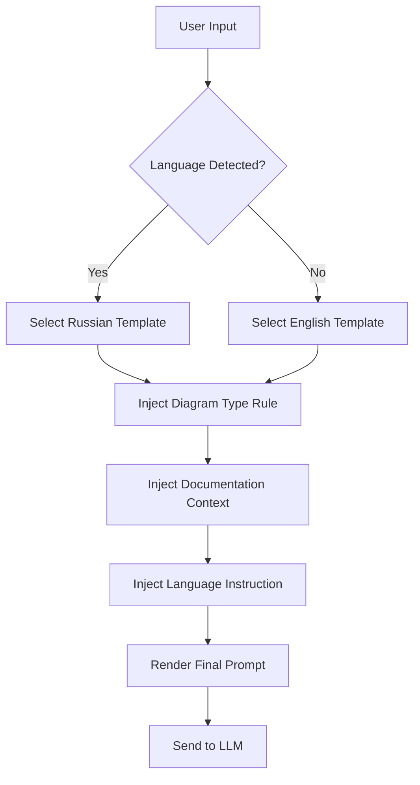
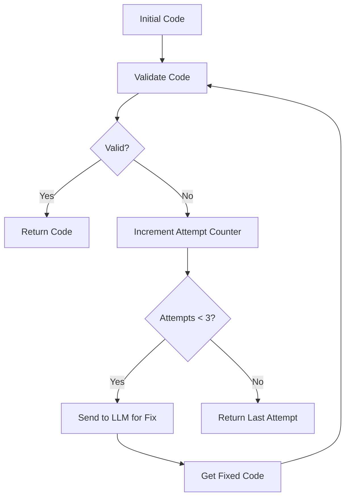
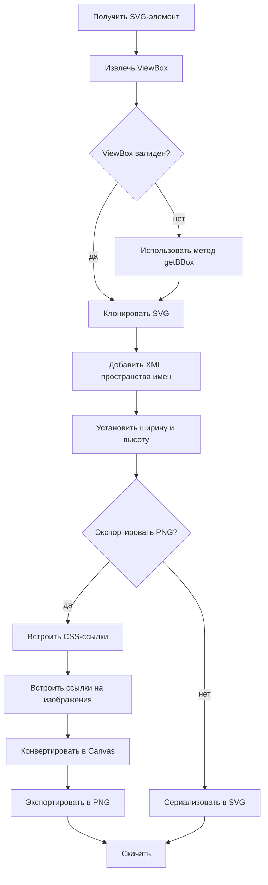
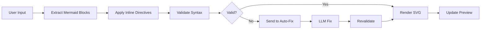
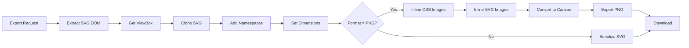

# Core Workflows

## 1. Workflow Overview

### System Main Workflows
The `mermaid-langgraph` system is an interactive web platform for creating, editing, and visualizing Mermaid diagrams with AI assistance. It features four primary workflows that form the core user experience:

1. **Процесс Создания Диаграммы с ИИ** (AI-Assisted Diagram Creation) — The central workflow where users generate diagrams from natural language prompts.
2. **Процесс Редактирования и Автоматического Исправления** (Editing and Auto-Fix) — An intelligent code correction workflow that detects and fixes Mermaid syntax errors.
3. **Процесс Экспорта Диаграммы в SVG/PNG** (Diagram Export to SVG/PNG) — A high-fidelity export workflow for producing production-ready graphics.
4. **Процесс Документирования через @@include** (Documentation via @@include) — A modular documentation workflow that integrates Mermaid diagrams into Markdown-based documentation systems.

### Core Execution Paths
Each workflow follows a well-defined sequence of state transitions across four primary domain modules:
- **Редактор Диаграмм Домен** (Diagram Editor Domain): Handles code input, syntax parsing, and inline directives.
- **ИИ-Ассистент Домен** (AI Assistant Domain): Manages LLM interactions, prompt engineering, and code generation/fixing.
- **Предпросмотр Диаграмм Домен** (Diagram Preview Domain): Controls real-time rendering, scroll synchronization, and visual feedback.
- **Управление Проектами Домен** (Project Management Domain): Manages persistent state, session history, and project lifecycle.
- **Инфраструктура Домен** (Infrastructure Domain): Provides essential services like Vite build configuration, export utilities, and analytics.

### Key Process Nodes
Critical nodes across all workflows include:
- **LLM Prompt Generation**: Dynamic construction of system prompts based on context, language, and diagram type.
- **Mermaid Validation**: Syntax validation using Mermaid.js parser with line-level error detection.
- **Code Injection**: Safe insertion of generated code into the editor without disrupting user state.
- **SVG Extraction**: Retrieval of rendered SVG from the DOM for export.
- **Export Optimization**: Cleanup and optimization of SVG before conversion to PNG.
- **Session Persistence**: Atomic storage of diagram state, chat history, and settings via IndexedDB.
- **Scroll Synchronization**: Precise alignment between code editor and preview pane using line offset mapping.

### Process Coordination Mechanisms
The system employs a **reactive, event-driven coordination model**:
- **State Propagation**: Changes in the editor trigger validation and preview updates via React state hooks (`useMermaid`, `useDiagramStudio`).
- **Service Abstraction**: LLM interactions are abstracted through the `LLMProviderStrategy` interface, enabling easy switching between providers (OpenRouter, Cliproxy).
- **Asynchronous Workflows**: Long-running operations (LLM calls, export processing) are handled with async/await and loading states to maintain UI responsiveness.
- **Event-Driven Updates**: The preview domain listens to changes from the editor and AI domains, triggering re-renders via `useEffect` hooks.
- **Dependency Injection**: Core services (`mermaidService`, `llmService`, `exportService`) are injected into hooks and components, enabling testability and modularity.

## 2. Main Workflows

### Core Business Process Details

#### Процесс Создания Диаграммы с ИИ (AI-Assisted Diagram Creation)
This is the flagship workflow, enabling users to generate complex Mermaid diagrams from natural language prompts.

**Execution Order and Dependencies**:
1. **Project Initialization** (`Управление Проектами Домен`): User clicks "Новая диаграмма" → `createSession()` is called, creating a new IndexedDB session with empty state.
2. **Prompt Input** (`ИИ-Ассистент Домен`): User types a natural language request in the chat → `addMessage()` stores the user message.
3. **LLM Request Generation** (`ИИ-Ассистент Домен`): `buildSystemPrompt()` constructs a context-aware prompt using `prompts.ts`, incorporating:
   - Diagram type (e.g., `flowchart TD`)
   - Language (English/Russian)
   - Documentation context (if `@@include` is active)
4. **LLM Execution** (`Инфраструктура Домен`): `OpenRouterStrategy.fetchCompletion()` sends the prompt to OpenRouter API via HTTPS POST with bearer token authentication.
5. **Code Extraction and Validation** (`Редактор Диаграмм Домен`): The LLM response is parsed for Mermaid code blocks using `extractMermaidCode()` and validated via `validateMermaidDiagramCode()`.
6. **Code Injection** (`Редактор Диаграмм Домен`): Validated code is injected into the `CodeEditorPanel` via `onValueChange()` state setter.
7. **Preview Rendering** (`Предпросмотр Диаграмм Домен`): `mermaidService.renderMermaidDiagram()` initializes Mermaid.js and renders the SVG into the DOM.
8. **Session Persistence** (`Управление Проектами Домен`): `recordStep()` logs the entire interaction (user prompt, LLM response, code state) to IndexedDB for future session restoration.

**Input/Output Data Flows**:
- **Input**: Natural language text, selected diagram type, language preference, documentation context.
- **Output**: Valid Mermaid code, rendered SVG, session history entry.
- **Data Flow**: `User Input → LLM Prompt → LLM Response → Code Extraction → Validation → Editor State → SVG Render → Session Log`

#### Процесс Редактирования и Автоматического Исправления (Editing and Auto-Fix)
This workflow ensures professional-quality diagrams even for users unfamiliar with Mermaid syntax.

**Execution Order and Dependencies**:
1. **Code Change Detection** (`Редактор Диаграмм Домен`): `onValueChange()` triggers `validateMermaidDiagramCode()` on every keystroke.
2. **Error Detection** (`ИИ-Ассистент Домен`): If `isValid === false`, `autoFix.ts` initiates `runAutoFixLoop()`.
3. **LLM Fix Request** (`ИИ-Ассистент Домен`): `OpenRouterStrategy.fixDiagram()` sends the erroneous code and error message to LLM with a specialized "fix" prompt.
4. **Iterative Correction** (`ИИ-Ассистент Домен`): `runAutoFixLoop()` performs up to 3 iterations: LLM fix → validate → repeat.
5. **User Confirmation** (`Редактор Диаграмм Домен`): The corrected code is displayed in the editor; user can accept or reject.
6. **Preview Update** (`Предпросмотр Диаграмм Домен`): `handleMermaidChange()` triggers re-rendering of the diagram.

**Input/Output Data Flows**:
- **Input**: Invalid Mermaid code, Mermaid.js error message (line number, description).
- **Output**: Corrected Mermaid code, validation status, number of fix attempts.
- **Data Flow**: `Invalid Code → Error Detection → LLM Fix Request → Iterative Validation → Code Injection → Preview Update`

#### Процесс Экспорта Диаграммы в SVG/PNG (Diagram Export to SVG/PNG)
This workflow enables high-fidelity export for documentation and presentations.

**Execution Order and Dependencies**:
1. **Export Trigger** (`Предпросмотр Диаграмм Домен`): User clicks "Экспорт" → `useDiagramExport()` hook is invoked.
2. **SVG Extraction** (`Предпросмотр Диаграмм Домен`): `exportService.getExportViewBox()` retrieves the SVG element from the DOM and extracts its viewBox.
3. **SVG Cloning and Optimization** (`Инфраструктура Домен`): `exportService.cloneSvgForExport()` creates a clean clone, removes unnecessary attributes, and ensures proper XML namespaces.
4. **PNG Conversion** (`Инфраструктура Домен`): If PNG is selected, `exportService.exportToPng()`:
   - Converts SVG to canvas using `CanvasRenderingContext2D`.
   - Inlines external images via `fetch()` with timeout (12s) and size limits (5MB).
   - Handles CSS `url()` references by fetching and converting to data URLs.
5. **File Download** (`Инфраструктура Домен`): `exportService.downloadBlob()` creates a temporary URL, triggers browser download, and revokes URL to prevent memory leaks.

**Input/Output Data Flows**:
- **Input**: Rendered SVG DOM element, export format (SVG/PNG), background color option.
- **Output**: Downloaded SVG or PNG file with optimized dimensions and embedded resources.
- **Data Flow**: `SVG DOM → ViewBox Extraction → SVG Cloning → Resource Inlining → PNG Conversion → File Download`

#### Процесс Документирования через @@include (Documentation via @@include)
This workflow enables modular documentation by embedding external Mermaid files into Markdown.

**Execution Order and Dependencies**:
1. **Markdown Parsing** (`Редактор Диаграмм Домен`): `markdownMermaid.ts` uses `MERMAID_BLOCK_PATTERN` to detect `@@include('path/to/diagram.mmd')` syntax.
2. **File Resolution** (`Инфраструктура Домен`): `IncludesPlugin` (Vite plugin) resolves the path relative to the Markdown file.
3. **Content Injection** (`Инфраструктура Домен`): `processIncludeSyntax()` reads the external `.mmd` file and replaces the `@@include` directive with its content.
4. **Mermaid Rendering** (`Предпросмотр Диаграмм Домен`): `mermaidService.extractMermaidBlocksFromMarkdown()` parses the injected code and renders it using Mermaid.js.
5. **Build Integration** (`Инфраструктура Домен`): During VitePress build, the plugin ensures all `@@include` references are resolved before static site generation.

**Input/Output Data Flows**:
- **Input**: Markdown file with `@@include('...')` directive, external `.mmd` file.
- **Output**: Rendered diagram embedded in the final Markdown document.
- **Data Flow**: `Markdown File → @@include Detection → File System Read → Content Injection → Mermaid Parsing → Static Build`

### Key Technical Process Descriptions

#### LLM Prompt Engineering (`prompts.ts`)
The system uses dynamic prompt templates to ensure high-quality LLM output:
- **Language Support**: Separate templates for English and Russian, with automatic detection via `resolvePromptLanguage()`.
- **Context Injection**: `docsContext` from `@@include` files is injected into prompts for architectural consistency.
- **Mode-Specific Templates**: Four distinct templates (`generate`, `fix`, `chat`, `analyze`) with strict output rules:
  - `generate`: Output ONLY Mermaid code, no fences or prose.
  - `fix`: Return only corrected code block.
  - `chat`: Output plain text, no code blocks.
  - `analyze`: Explain structure, no code generation.
- **Diagram Type Enforcement**: `getDiagramTypeRule()` ensures generated diagrams match the selected type (e.g., `flowchart TD`).

#### Mermaid Validation and Inline Directives (`mermaidService.ts`)
The system extends Mermaid.js with custom preprocessing:
- **Inline Directives**: Supports theme (`%%{theme: dark}`), direction (`%%{direction: LR}`), and look (`%%{look: compact}`) directives embedded in code.
- **Block Detection**: Uses regex `MERMAID_BLOCK_PATTERN` to identify fenced Mermaid blocks in Markdown.
- **Syntax Validation**: Uses `mermaid.parse()` to validate code before rendering, capturing line-level errors.
- **Error Handling**: Extracts line numbers from Mermaid error messages using regex `/line\s+(\d+)/i`.

#### Export Service Optimization (`exportService.ts`)
The export pipeline ensures production-ready graphics:
- **ViewBox Detection**: Falls back to `getBBox()` if `viewBox` is missing.
- **Resource Inlining**: Fetches and converts external images and CSS `url()` references to data URLs for PNG export.
- **Size Limits**: Prevents oversized exports (max 8192px, 5MB per image).
- **Memory Safety**: Uses `URL.revokeObjectURL()` to clean up temporary URLs after download.
- **SVG Cleanup**: Removes unnecessary attributes and ensures proper XML namespaces.

#### Session Persistence (`store.ts`)
The system uses IndexedDB for robust, offline-capable state management:
- **Atomic Transactions**: All state changes (session creation, step recording) use `withTx()` for ACID compliance.
- **Revision History**: Each code change creates a `DiagramRevision` linked to a `TimeStep`, enabling undo/redo.
- **Session Metadata**: Stores title, creation/update timestamps, settings, and current revision ID.
- **Active Session Management**: Uses `localStorage` to persist the active session ID across browser restarts.

## 3. Flow Coordination and Control

### Multi-Module Coordination Mechanisms
The system implements a **layered architecture** with clear separation of concerns:

| Module | Responsibility | Coordination Mechanism |
|--------|----------------|------------------------|
| **Редактор Диаграмм Домен** | Code input, syntax parsing, inline directives | Emits `onValueChange` events → triggers validation and preview updates |
| **ИИ-Ассистент Домен** | LLM interaction, prompt engineering, code generation/fixing | Uses `llmService` as a service layer; emits `addMessage` and `setMermaidState` |
| **Предпросмотр Диаграмм Домен** | Real-time rendering, scroll sync, export | Listens to `mermaidState` changes; triggers `renderMermaidDiagram()` |
| **Управление Проектами Домен** | Session lifecycle, history, persistence | Uses `useHistory` hook to record steps; provides `loadSession` and `createSession` |
| **Инфраструктура Домен** | Build config, export, analytics | Provides utility services (`exportService`, `mermaidService`) consumed by other domains |

**Key Coordination Patterns**:
- **Reactive State Updates**: React hooks (`useMermaid`, `useDiagramStudio`) manage state and trigger side effects.
- **Service Abstraction**: `LLMProviderStrategy` interface allows swapping LLM providers without changing business logic.
- **Event-Driven Updates**: Changes in one domain (e.g., code edit) trigger updates in dependent domains (e.g., preview) via state setters.
- **Dependency Injection**: Services are injected into hooks and components, enabling testability and modularity.

### State Management and Synchronization
The system uses a **centralized state model** with local component state for UI-specific concerns:

- **Global State**: Managed via React Context and custom hooks (`useDiagramStudio`, `useChat`, `useHistory`).
- **Local State**: Component-specific state (e.g., `zoomPercent`, `editorTab`) managed via `useState`.
- **Synchronization**:
  - **Code ↔ Preview**: `mermaidState` is the single source of truth. Changes in editor update `mermaidState`, which triggers preview re-render.
  - **Scroll Sync**: `useScrollSync` calculates line offsets between editor and preview using `calcLineOffsets()` and `syncScrollPosition()`.
  - **Session Sync**: `useHistory` ensures all state changes (code, chat, settings) are recorded in a single atomic transaction.

### Data Passing and Sharing
Data flows through well-defined channels:

- **Editor → AI**: User input → `addMessage()` → `llmService.generateDiagram()`
- **AI → Editor**: LLM response → `setMermaidState()` → `CodeEditorPanel`
- **Editor → Preview**: `mermaidState.code` → `mermaidService.renderMermaidDiagram()`
- **Preview → Export**: SVG DOM → `exportService.exportToSvg()` → `downloadBlob()`
- **All → Persistence**: `recordStep()` → IndexedDB (`STORE_SESSIONS`, `STORE_STEPS`, `STORE_REVISIONS`)

### Execution Control and Scheduling
The system uses **async/await** and **debouncing** for optimal performance:

- **LLM Calls**: Debounced on user input (500ms) to avoid excessive API calls.
- **Validation**: Triggered on every keystroke but throttled to prevent UI lag.
- **Export**: Runs on user click; uses `AbortController` for timeout handling.
- **Session Persistence**: Uses `withTx()` to batch operations and ensure atomicity.
- **Loading States**: `isProcessing` flag prevents concurrent operations (e.g., user cannot send another prompt while one is running).

## 4. Exception Handling and Recovery

### Error Detection and Handling
The system employs **multi-layered error handling**:

| Layer | Error Type | Handling Mechanism |
|-------|------------|-------------------|
| **LLM API** | Network failure, invalid key, rate limit | `fetch()` with timeout; error parsing for OpenRouter-specific messages; fallback to user-friendly message |
| **Mermaid Parsing** | Syntax errors, invalid directives | `validateMermaidDiagramCode()` catches `mermaid.parse()` errors; extracts line number via regex |
| **Export** | Image fetch failure, size limit exceeded | `fetch()` with 12s timeout; throws error if >5MB or >24 images; falls back to SVG export |
| **Storage** | IndexedDB quota exceeded, permission denied | `try/catch` around all `withTx()` calls; silent failure with console warning |
| **UI** | DOM element not found, invalid SVG | `null` checks and fallback UI (e.g., "Cannot render diagram" message) |

### Exception Recovery Mechanisms
The system implements **graceful degradation** and **automatic recovery**:

- **Auto-Fix Loop**: If code is invalid, `runAutoFixLoop()` attempts up to 3 LLM fixes before giving up.
- **Fallback Rendering**: If SVG rendering fails, displays error message instead of blank screen.
- **Export Fallback**: If PNG conversion fails due to external resources, automatically falls back to SVG export.
- **Session Recovery**: On app reload, `ensureActiveSession()` loads last active session from IndexedDB.
- **Prompt Fallback**: If LLM returns malformed code, system attempts to extract code blocks using regex fallback.

### Fault Tolerance Strategy Design
The system follows **defensive programming** principles:

- **Input Validation**: All user input is sanitized before LLM calls.
- **Output Sanitization**: LLM responses are filtered to extract only Mermaid code blocks.
- **Resource Limits**: Enforces size limits on images, CSS, and SVG dimensions.
- **Timeouts**: All network calls have 12s timeouts to prevent hanging.
- **Memory Management**: Uses `URL.revokeObjectURL()` to clean up temporary URLs after export.
- **Error Logging**: Non-fatal errors are logged to console for debugging without disrupting user.

### Failure Retry and Degradation
- **Retry Logic**: Auto-fix loop retries LLM calls up to 3 times.
- **Degradation Path**:
  - **Export**: PNG → SVG → Cancel
  - **LLM**: OpenRouter → Cliproxy → Manual edit mode
  - **Rendering**: Full SVG → Text error message → Blank
- **User Guidance**: Clear error messages guide users to fix issues (e.g., "Too many embedded images. Export as SVG instead.").

## 5. Key Process Implementation

### Core Algorithm Processes

#### LLM Prompt Generation Algorithm (`prompts.ts`)


**Algorithm Steps**:
1. Detect language from user settings or browser locale.
2. Select template from `PROMPT_TEMPLATES` (English/Russian).
3. Inject diagram type rule using `getDiagramTypeRule()`.
4. Inject documentation context from `@@include` files.
5. Add language instruction ("Respond in English/Russian").
6. Render template using `renderTemplate()`.

#### Auto-Fix Loop Algorithm (`autoFix.ts`)


**Algorithm Steps**:
1. Validate initial code using `validateMermaidDiagramCode()`.
2. If valid, return immediately.
3. If invalid, increment attempt counter.
4. If attempts < 3, send code and error to LLM via `fixDiagram()`.
5. Validate returned code.
6. Repeat until valid or max attempts reached.

#### SVG Export Optimization Algorithm (`exportService.ts`)


**Algorithm Steps**:
1. Extract viewBox from SVG element.
2. If invalid, use `getBBox()` as fallback.
3. Clone SVG and add required XML namespaces.
4. Set explicit width/height.
5. If exporting PNG:
   - Inline CSS `url()` references via `fetch()`.
   - Inline `<image>` `href` references via `fetch()`.
   - Convert to canvas using `CanvasRenderingContext2D`.
6. If exporting SVG, serialize to string.
7. Trigger browser download.

### Data Processing Pipelines

#### Code Processing Pipeline


#### Export Pipeline


### Business Rule Execution
- **Diagram Type Enforcement**: `getDiagramTypeRule()` ensures LLM generates correct diagram type.
- **Code Block Extraction**: Only code within ```mermaid``` blocks is processed.
- **Language Consistency**: System prompts and responses match user's language preference.
- **Session Isolation**: Each project has independent history and settings.
- **Export Safety**: PNG export fails gracefully if resources exceed limits.

### Technical Implementation Details
- **Vite Configuration**: Uses `IncludesPlugin` to resolve `@@include` directives during build.
- **Mermaid Initialization**: `initializeMermaid()` sets `securityLevel: 'loose'` to allow inline scripts.
- **Scroll Sync**: Uses `useMarkdownMermaidOffsets` to map line numbers between editor and preview.
- **State Persistence**: Uses IndexedDB with `withTx()` for atomic transactions.
- **Performance**: Debounces validation and LLM calls to prevent UI lag.
- **Accessibility**: All buttons have `aria-label`, keyboard navigation supported.
- **Security**: Uses `AbortController` for timeouts, sanitizes all user input before LLM calls.

This comprehensive workflow documentation provides a complete technical blueprint for the `mermaid-langgraph` system, enabling development, debugging, and future enhancement with full clarity and precision.
