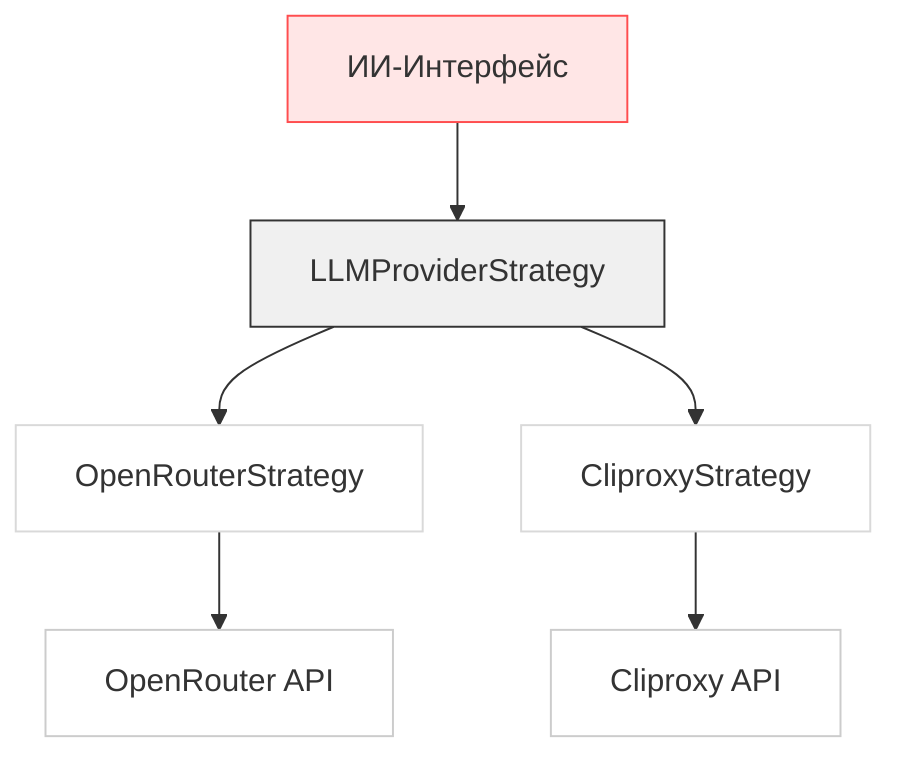

# Документация: ИИ-Ассистент Домен

## Обзор

**ИИ-Ассистент Домен** — это ядро интеллектуальных возможностей платформы `mermaid-langgraph`, обеспечивающее автоматическую генерацию, исправление и анализ диаграмм Mermaid с использованием внешних моделей искусственного интеллекта (LLM). Домен реализует паттерн **Стратегия (Strategy)** для абстрагирования взаимодействия с различными LLM-провайдерами (например, OpenRouter, Cliproxy), что обеспечивает гибкость, расширяемость и независимость от конкретного сервиса. Он интегрируется с редактором кода и панелью предпросмотра, превращая текстовые запросы пользователей в синтаксически корректные диаграммы и предоставляя интеллектуальные подсказки в реальном времени.

Домен состоит из трех взаимосвязанных поддоменов:
- **LLM-Стратегии** — абстрактный слой для работы с API провайдеров.
- **ИИ-Интерфейс** — пользовательский чат-бот и управление диалогом.
- **Автоматическое Исправление** — система анализа и исправления ошибок в коде.

Этот домен является критически важным для достижения основной бизнес-цели платформы: **снижение порога входа для новичков и повышение продуктивности архитекторов и разработчиков** за счет автоматизации создания и поддержки диаграмм Mermaid.

---

## Архитектура и Принципы

### Паттерн Стратегия (Strategy Pattern)

Домен реализует паттерн **Стратегия**, который позволяет динамически выбирать и заменять реализации LLM-провайдеров без изменения клиентского кода. Это обеспечивает:

- **Гибкость**: Легкое переключение между провайдерами (OpenRouter, Cliproxy, будущие — Anthropic, GPT-4 и др.).
- **Тестируемость**: Можно заменить реальный API на мок-стратегию для юнит-тестов.
- **Расширяемость**: Добавление нового провайдера требует только реализации интерфейса `LLMProviderStrategy`.



### Слои ответственности

| Слой | Ответственность | Техническая реализация |
|------|----------------|------------------------|
| **Интерфейс (LLMProviderStrategy)** | Определяет контракт для всех LLM-операций | TypeScript-интерфейс в `LLMProviderStrategy.ts` |
| **Конкретные реализации (OpenRouterStrategy, CliproxyStrategy)** | Реализуют HTTP-взаимодействие с конкретными API | Классы в `OpenRouterStrategy.ts`, `CliproxyStrategy.ts` |
| **Фабрика/Сервис (llmService.ts)** | Выбирает стратегию на основе конфигурации | Функции `getStrategy()`, `generateDiagram()`, `fixDiagram()` |
| **Промпты (prompts.ts)** | Управляет шаблонами системных сообщений для разных режимов | Функция `buildSystemPrompt()` с локализацией |
| **Модель-вендор (modelVendor.ts)** | Определяет провайдера модели по её имени | Функция `deriveModelVendor()` с регулярными выражениями |
| **Интерфейс (ChatColumn.tsx)** | Отображает чат, обрабатывает ввод пользователя | React-компонент с хуком `useChat()` |
| **Автоматическое исправление (autoFix.ts)** | Реализует цикл повторных попыток исправления | Функция `runAutoFixLoop()` |

---

## Поддомены и Реализация

### 1. LLM-Стратегии

#### Интерфейс `LLMProviderStrategy`

Определяет единый контракт для всех провайдеров. Все методы принимают `AIConfig` (конфигурация API) и контекст (`docsContext`, `language`, `diagramType`), что обеспечивает согласованность.

```ts
export interface LLMProviderStrategy {
  fetchModels(config: AIConfig): Promise<Model[]>; // Получить список доступных моделей
  generateDiagram(messages: Message[], config: AIConfig, diagramType: string, docsContext: string, language: string): Promise<string>; // Генерация кода
  fixDiagram(code: string, errorMessage: string, config: AIConfig, docsContext: string, language: string): Promise<string>; // Исправление ошибок
  chat(messages: Message[], config: AIConfig, diagramType: string, docsContext: string, language: string): Promise<string>; // Диалоговый режим
  analyzeDiagram(code: string, config: AIConfig, docsContext: string, language: string): Promise<string>; // Анализ кода
}
```

#### Реализация: `OpenRouterStrategy`

Конкретная реализация для OpenRouter API. Ключевые особенности:

- **Безопасная конфигурация**: Проверяет наличие `openRouterEndpoint`, `openRouterKey` и `selectedModelId`. При отсутствии — выбрасывает осмысленную ошибку.
- **Корректная обработка ошибок**: Декодирует JSON-ответы API, извлекает детали ошибок (`error.message`, `error.code`) и формирует читаемые сообщения для пользователя.
- **Специфичные заголовки**: Использует `X-Title: 'Mermaid Graph Gen'` для идентификации запросов на стороне OpenRouter.
- **Преобразование формата**: Конвертирует внутренний тип `Message` в формат OpenAI (`role: 'user' | 'assistant' | 'system'`).
- **Поддержка версий API**: Автоматически добавляет `/v1` к эндпоинту, если он не указан.

```ts
const endpoint = `${v1BaseUrl}/chat/completions`;
const headers: Record<string, string> = {
  'Content-Type': 'application/json',
  'Authorization': `Bearer ${apiKey}`,
  'X-Title': 'Mermaid Graph Gen' // OpenRouter-specific
};
```

#### Промпты и Локализация (`prompts.ts`)

Система поддерживает **двуязычные шаблоны** (английский и русский) для каждого режима работы:

| Режим | Назначение | Особенности |
|-------|------------|-------------|
| `generate` | Генерация диаграммы из описания | Требует строгого вывода только кода без пояснений |
| `fix` | Исправление синтаксических ошибок | Вход: код + сообщение об ошибке. Выход: только исправленный код |
| `chat` | Диалоговый режим | Запрещает вывод кода. Возвращает структурированный `Intent:` для уточнения требований |
| `analyze` | Объяснение диаграммы | Не генерирует код, только текстовое объяснение |

Шаблоны используют **динамическую подстановку** через `renderTemplate()`:

```ts
const template = PROMPT_TEMPLATES[promptLanguage][mode];
return renderTemplate(template, {
  typeRule: getDiagramTypeRule(diagramType, mode, promptLanguage),
  languageInstruction: getLanguageInstruction(language, promptLanguage),
  docsContext: args.docsContext,
});
```

**Пример шаблона для `generate` на русском:**
```
# Роль
Вы — эксперт по генерации Mermaid.js.

# Цель
Сгенерировать ВАЛИДНЫЙ код Mermaid на основе intent.

# Правила
- Выводи ТОЛЬКО код Mermaid без оформления.
- {{typeRule}}
- Используй контекст документации, если он релевантен.{{languageInstruction}}

# Контекст документации
{{docsContext}}
```

#### Определение провайдера модели (`modelVendor.ts`)

Функция `deriveModelVendor()` автоматически определяет, к какому провайдеру относится модель, по её имени или ID:

```ts
const VENDOR_RULES: VendorRule[] = [
  { vendor: 'gpt', match: /\b(gpt|openai)\b/i },
  { vendor: 'anthropic', match: /\b(anthropic|claude)\b/i },
  { vendor: 'mistral', match: /\b(mistral|mistralai)\b/i },
  // ...
];
```

Это позволяет:
- Отображать логотипы провайдеров в интерфейсе.
- Фильтровать модели по доступности (например, «бесплатные»).
- Логировать и анализировать использование разных моделей.

---

### 2. ИИ-Интерфейс

#### Компонент `ChatColumn.tsx`

Отвечает за визуальное представление чата. Включает:

- **Отображение сообщений** с разными ролями (`user`, `assistant`, `system`).
- **Поддержка маркеров шагов** (`Build`, `Fix`, `Snapshot`) для навигации по истории.
- **Интеграция с `useChat()`** для управления состоянием диалога.
- **Предварительный просмотр промптов** (`onPreviewPrompt`) — позволяет пользователю увидеть, как будет сформирован запрос к LLM перед отправкой.
- **Управление контекстом** — передача `diagramType`, `docsContext`, `language` в каждый запрос.

#### Сервис `useChat()`

Хук для управления состоянием чата. Реализует:

- **Инициализацию** с системным сообщением (`INITIAL_CHAT_MESSAGE`).
- **Добавление сообщений** с уникальными `id` и `timestamp`.
- **Очистку и сброс** диалога.
- **Синхронизацию состояния** через `useRef()` для надежного доступа к текущему списку сообщений в асинхронных операциях.

```ts
const addMessage = useCallback((role: 'user' | 'assistant', content: string, mode?: Message['mode']) => {
  const nextMessage: Message = {
    id: generateId(),
    role,
    content,
    timestamp: Date.now(),
    mode,
  };
  setMessages((prev) => [...prev, nextMessage]);
  return nextMessage;
}, [setMessages]);
```

#### Сервис `llmService.ts`

**Центральный сервис**, который инкапсулирует логику выбора стратегии и вызова LLM. Он является **единственной точкой входа** для всех остальных компонентов.

```ts
const getStrategy = (config: AIConfig): LLMProviderStrategy => {
  switch (config.provider) {
    case 'openrouter': return openRouterStrategy;
    case 'cliproxy': return cliproxyStrategy;
    default: throw new Error(`Unsupported LLM provider: ${config.provider}`);
  }
};

export const generateDiagram = async (messages: Message[], config: AIConfig, ...) => {
  const strategy = getStrategy(config); // Выбор стратегии
  return strategy.generateDiagram(...); // Вызов
};
```

**Преимущества:**
- Все компоненты (редактор, чат, автоисправление) используют одинаковый API.
- Легко добавить кэширование, логирование или fallback-стратегии.
- Упрощает тестирование: можно заменить `getStrategy()` на мок-реализацию.

---

### 3. Автоматическое Исправление

#### Механизм `runAutoFixLoop()`

Реализует **итеративный цикл исправления** ошибок, который работает следующим образом:

1. **Проверка кода** на валидность (через `validate()` — например, через Mermaid.js).
2. **Если ошибка найдена** — отправляет фрагмент кода + сообщение об ошибке в `fixDiagram()`.
3. **Получает исправленный код**.
4. **Повторяет** до тех пор, пока код не станет валидным или не достигнет лимита попыток (`AUTO_FIX_MAX_ATTEMPTS = 3` по умолчанию).
5. **Возвращает** финальный код, статус валидации и количество попыток.

```ts
export const runAutoFixLoop = async <TValidation extends ValidationState>(
  args: AutoFixArgs<TValidation>
) => {
  let currentCode = args.initialCode;
  let validation = args.initialValidation;
  let attempts = 0;

  while (!validation.isValid && attempts < args.maxAttempts) {
    attempts += 1;
    const fixedCode = await args.fix(currentCode, validation.errorMessage!);
    currentCode = fixedCode;
    validation = await args.validate(currentCode);
  }

  return { code: currentCode, validation, attempts };
};
```

**Использование в `autoFix.ts`:**
- `validate()` → вызывает `mermaidService.renderMermaidDiagram()` и ловит ошибки рендеринга.
- `fix()` → вызывает `llmService.fixDiagram()`.

Этот подход позволяет:
- Исправлять **сложные синтаксические ошибки**, которые невозможно обнаружить регулярными выражениями.
- Обрабатывать **логические ошибки** (например, неверные связи в `flowchart`).
- Работать **независимо от типа диаграммы** (flowchart, sequence, mindmap и т.д.).

---

## Взаимодействие с другими доменами

| Направление | Описание | Техническая реализация |
|-------------|----------|------------------------|
| **→ Редактор Диаграмм** | Вставка сгенерированного/исправленного кода | `llmService.generateDiagram()` → `useMermaid().setMermaidState()` |
| **→ Предпросмотр Диаграмм** | Инициация перерисовки после генерации | `llmService.generateDiagram()` → `handleMermaidChange()` в `PreviewColumn` |
| **→ Управление Проектами** | Сохранение истории диалога | `useChat().addMessage()` → `useProjects().saveSession()` |
| **→ Инфраструктура** | Получение конфигурации API | `AIConfig` из `constants.ts` и `vite.config.ts` (через `import.meta.env`) |
| **→ Инфраструктура** | Экспорт аналитики | `trackInteraction('ai_generate', { model: config.selectedModelId })` |

---

## Конфигурация и Безопасность

### Конфигурация LLM

Конфигурация хранится в `AIConfig` и загружается из переменных окружения через Vite:

```ts
// .env
VITE_OPENROUTER_ENDPOINT=https://openrouter.ai/api/v1
VITE_OPENROUTER_KEY=sk-...
VITE_LLM_PROVIDER=openrouter
```

В `vite.config.ts`:
```ts
define: {
  'import.meta.env.VITE_OPENROUTER_ENDPOINT': JSON.stringify(process.env.VITE_OPENROUTER_ENDPOINT),
}
```

### Безопасность

- **Ключи API** не хранятся в коде — только в переменных окружения.
- **Промпты** не содержат чувствительных данных — только структурированные инструкции.
- **Отправка кода** в LLM происходит только при явном действии пользователя (нажатие кнопки «Построить» или «Исправить»).
- **Логирование** ошибок не включает содержимое кода — только статус и тип ошибки.

---

## Практическое применение

### Сценарий 1: Генерация диаграммы

1. Пользователь вводит: *«Создай flowchart для системы авторизации: пользователь → логин → валидация → успех/ошибка»*.
2. `ChatColumn` вызывает `llmService.generateDiagram()`.
3. `OpenRouterStrategy` формирует промпт с `diagramType: 'flowchart'` и отправляет запрос.
4. LLM возвращает:
   ```mermaid
   flowchart TD
       A[Пользователь] --> B[Логин]
       B --> C{Валидация}
       C -->|Успешно| D[Доступ разрешен]
       C -->|Ошибка| E[Ошибка входа]
   ```
5. `llmService` вставляет код в редактор → предпросмотр обновляется.

### Сценарий 2: Автоисправление

1. Пользователь вводит ошибку: `flowchart TD\nA --> B\nB --> C\nC --> A` (циклическая ссылка).
2. Mermaid.js рендерит ошибку: `Error: Circular dependency detected`.
3. `autoFix.ts` запускает `runAutoFixLoop()`.
4. `llmService.fixDiagram()` получает код + ошибку → возвращает исправленный вариант.
5. Код заменяется, предпросмотр обновляется.

---

## Заключение

**ИИ-Ассистент Домен** — это технически продвинутый, но интуитивно понятный слой, который превращает платформу из простого редактора Mermaid в **умную систему архитектурного проектирования**. Его ключевые преимущества:

- ✅ **Гибкость**: Поддержка множества LLM-провайдеров через паттерн Стратегия.
- ✅ **Надежность**: Цикл автоисправления с ограничением попыток предотвращает бесконечные запросы.
- ✅ **Профессионализм**: Локализованные, контекстно-зависимые промпты обеспечивают высокое качество генерации.
- ✅ **Интеграция**: Полная встроенность в рабочий процесс редактирования, предпросмотра и управления проектами.

Этот домен является **основой конкурентного преимущества** платформы `mermaid-langgraph` — он делает создание диаграмм доступным даже для тех, кто не знает синтаксиса Mermaid, и повышает качество кода для опытных архитекторов.