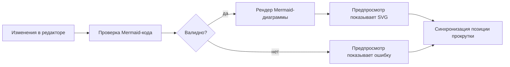
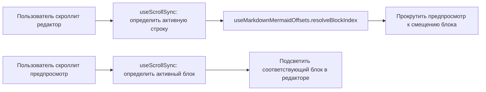
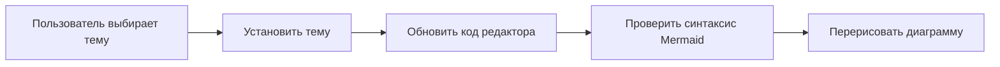

# Документация: Предпросмотр Диаграмм Домен

## Обзор домена

**Предпросмотр Диаграмм Домен** — это критически важный компонент платформы **mermaid-langgraph**, отвечающий за мгновенную, стабильную и интерактивную визуализацию диаграмм Mermaid в реальном времени. Домен обеспечивает прямую связь между текстовым кодом диаграммы, вводимым пользователем в редакторе, и его визуальным представлением, создавая непрерывный цикл обратной связи, который является основой пользовательского опыта.

Домен реализован как реактивная система, основанная на компонентах React и кастомных хуках, и интегрирован с библиотекой **Mermaid.js** как основным движком рендеринга. Его ключевая задача — не просто отобразить SVG-изображение, а обеспечить надежную обработку ошибок, динамическое управление стилями, синхронизацию с редактором кода и поддержку сложных сценариев, включая встраивание диаграмм в Markdown-документы.

Домен состоит из двух взаимосвязанных поддоменов: **Рендерер Диаграмм** и **Синхронизация Показа**, которые совместно обеспечивают точность, отзывчивость и удобство навигации.

---

## Поддомен 1: Рендерер Диаграмм

Рендерер Диаграмм — это ядро домена, отвечающее за инициализацию, обновление и отображение диаграмм. Он инкапсулирует всю логику взаимодействия с Mermaid.js, обработки команд и управления состоянием ошибок.

### Основные компоненты

#### 1. `mermaidService.ts` — Сервис рендеринга

Этот файл является центральным модулем рендерера. Он предоставляет набор чистых, тестируемых функций для работы с Mermaid.js, изолируя сложность библиотеки от компонентов UI.

**Ключевые функции:**

- **`initializeMermaid(theme)`**  
  Инициализирует Mermaid.js с заданной темой (`default` или `dark`). Устанавливает `startOnLoad: false`, чтобы предотвратить автоматический рендеринг и дать полный контроль приложению.

- **`applyInlineMermaidDirectives(code)`**  
  Применяет пользовательские команды, встроенные в код диаграммы как комментарии. Эти команды (например, `%% theme: dark` или `%% direction: LR`) обрабатываются с помощью утилит `applyInlineDirectionCommand` и `applyInlineThemeAndLookCommands`, что позволяет динамически изменять стиль и направление диаграммы без изменения исходного кода.

- **`validateMermaid(code, options)`**  
  **Критически важная функция.** Проверяет синтаксис кода Mermaid с помощью `mermaid.parse()`. В случае ошибки:
  - Извлекает номер строки ошибки из сообщения (через регулярное выражение `line\s+(\d+)`).
  - Возвращает объект `MermaidState` с флагами `isValid: false`, `status: 'invalid'`, `errorMessage` и `errorLine`.
  - Логирует ошибку в консоль (если не отключено через `logError: false`).
  - Это позволяет системе не только обнаружить ошибку, но и точно указать пользователю, где она возникла.

- **`extractMermaidBlocksFromMarkdown(markdown)`**  
  Анализирует Markdown-документ, находя все блоки кода, заключенные в тройные обратные кавычки с языком `mermaid`. Возвращает массив объектов `MermaidMarkdownBlock`, содержащих код, позиции в документе и тип диаграммы. Это необходимо для поддержки встраивания диаграмм в документацию.

- **`setThemeForMarkdownMermaidBlocks(markdown, theme)` и `setLookForMarkdownMermaidBlocks(markdown, look)`**  
  Позволяют динамически изменять тему или внешний вид (look) всех диаграмм в Markdown-документе, заменяя соответствующие команды в каждом блоке. Это обеспечивает единообразие стиля при публикации документации.

#### 2. `PreviewBody.tsx` — Компонент отображения

Этот компонент управляет визуальным представлением диаграммы и пользовательским интерфейсом предпросмотра.

**Основные функции:**
- **Отображение SVG-контента:**  
  При наличии валидного `svgMarkup` компонент отображает его в `
`. Это обеспечивает прямую интеграцию с `svg-pan-zoom` (инициализируемым в другом месте), позволяя масштабировать и панорамировать диаграмму.

- **Обработка ошибок рендеринга:**  
  Компонент отображает понятные, визуально выделенные сообщения об ошибках в зависимости от контекста:
  - **Общая ошибка рендеринга:** Показывается, если `renderError` не пуст и диаграмма не в режиме Markdown.
  - **Ошибка в Markdown-блоке:** Показывается, если `isMarkdownMermaidInvalid` и `activeMarkdownErrorMessage` заданы.
  - **Синтаксическая ошибка:** Показывается, если `mermaidState.status === 'invalid'`.
  Все сообщения отображаются в центре экрана с полупрозрачным фоном, чтобы не мешать, но быть заметными.

- **Управление масштабированием:**  
  Панель управления (в правом верхнем углу) предоставляет кнопки:
  - **Zoom Out (`ZoomOut`)** — уменьшает масштаб.
  - **Zoom In (`ZoomIn`)** — увеличивает масштаб.
  - **Fit to Viewport (`Scan`)** — центрирует и масштабирует диаграмму под размер окна.
  Кнопки отключены, если диаграмма не загружена или включен режим Markdown.

- **Поддержка Markdown-режима:**  
  В режиме `isMarkdownMode` компонент отображает не SVG, а размеченный HTML-контент, полученный через `useMarkdownPreview`. Это позволяет пользователю просматривать весь документ, включая текст и диаграммы, как единое целое.

- **Поддержка режима документации (`isBuildDocsMode`):**  
  В этом режиме компонент отображает полный HTML-документ, собранный VitePress, в `
`, обеспечивая единый интерфейс для просмотра документации.

#### 3. `PreviewHeaderControls.tsx` — Управление темами

Хотя этот файл не был прочитан, согласно архитектурной документации, он предоставляет интерфейс для переключения тем (светлая/темная) и внешнего вида диаграммы. Он взаимодействует с `mermaidService` через вызовы `setThemeForMarkdownMermaidBlocks` и `setLookForMarkdownMermaidBlocks`, чтобы обновить все диаграммы в документе.

---

## Поддомен 2: Синхронизация Показа

Синхронизация Показа решает фундаментальную проблему навигации в длинных документах: как быстро найти, какой фрагмент кода в редакторе соответствует какой диаграмме в предпросмотре, и наоборот.

### Основные компоненты

#### 1. `useMarkdownMermaidOffsets.ts` — Хук для вычисления позиций

Этот кастомный хук вычисляет и хранит вертикальные позиции (offsets) каждого блока диаграммы в Markdown-документе относительно контейнера предпросмотра.

**Как это работает:**
1. При изменении контента (`refreshOffsets`) хук проходит по всем элементам с классом `.markdown-mermaid-block`.
2. Для каждого блока он извлекает атрибут `data-mermaid-index`, который соответствует порядковому номеру блока в документе.
3. Вычисляет его вертикальное положение (`rect.top - containerRect.top + container.scrollTop`) и сохраняет его в массив `offsetsRef.current` по индексу.
4. Предоставляет три полезные функции:
   - `resolveBlockIndex(scrollTop)` — находит индекс активного блока по текущему значению `scrollTop`.
   - `getOffset(index)` — возвращает позицию конкретного блока.

**Пример использования:**  
Если пользователь прокручивает предпросмотр до позиции 1200px, `resolveBlockIndex(1200)` вернет, например, `3`, что означает, что активен четвертый блок диаграммы.

#### 2. `useScrollSync.ts` — Синхронизация скролла

Хотя этот файл не был прочитан, согласно архитектурной документации, он использует `useMarkdownMermaidOffsets` для реализации двухсторонней синхронизации:
- **Из редактора в предпросмотр:** При прокрутке редактора кода, хук определяет, какой блок кода сейчас виден, и прокручивает предпросмотр к соответствующему `offset` диаграммы.
- **Из предпросмотра в редактор:** При прокрутке предпросмотра, хук определяет, какая диаграмма активна, и подсвечивает соответствующий блок кода в редакторе.

Эта синхронизация критически важна для работы с длинными документами, где пользователь может иметь десятки диаграмм. Она превращает предпросмотр из пассивного отображения в активный инструмент навигации.

#### 3. `useMarkdownPreview.ts` — Поддержка Markdown-рендеринга

Этот хук использует библиотеку **MarkdownIt** для преобразования Markdown-текста в HTML. Он:
- Рендерит весь документ в HTML-строку (`markdownHtml`).
- Применяет кастомные стили для блоков-вызовов (callouts), таких как `> [!NOTE]` или `> [!WARNING]`, преобразуя их в визуально выделенные блоки.
- Обеспечивает, что в режиме `isMarkdownMode` предпросмотр отображает не только диаграммы, но и весь текст документа в корректном формате.

---

## Взаимодействия и потоки данных

### Основной поток рендеринга

### Поток синхронизации

### Поток обновления темы

---

## Технические особенности и лучшие практики

1. **Инкапсуляция Mermaid.js:**  
   Все вызовы к `mermaid` изолированы в `mermaidService.ts`. Это позволяет легко заменить библиотеку в будущем (например, на другую визуализацию) без изменения UI-компонентов.

2. **Реактивность и производительность:**  
   Использование `useCallback` и `useMemo` в хуках предотвращает ненужные перерендеры. Вычисление позиций (`refreshOffsets`) происходит только при изменении контента, а не при каждом скролле.

3. **Обработка ошибок:**  
   Система не падает при синтаксических ошибках. Вместо этого она предоставляет пользователю понятное сообщение и сохраняет последний валидный код (`lastValidCode`), что позволяет продолжать работу.

4. **Поддержка Markdown-документации:**  
   Домен не просто рендерит диаграммы — он является полноценным Markdown-рендерером, что делает его незаменимым для технических писателей.

5. **Режимы работы:**  
   Четкое разделение режимов (`isMarkdownMode`, `isBuildDocsMode`, `isMarkdownMermaidMode`) позволяет одному компоненту (`PreviewBody`) корректно работать в разных сценариях использования.

---

## Заключение

Предпросмотр Диаграмм Домен — это не просто "окно с картинкой". Это сложная, интеллектуальная система, которая превращает абстрактный код в живой, интерактивный визуальный опыт. Благодаря тщательной архитектуре, основанной на разделении ответственности, реактивности и надежной обработке ошибок, домен обеспечивает:

- **Мгновенную обратную связь** — изменения в коде мгновенно отражаются в визуализации.
- **Профессиональное качество** — поддержка тем, стилей и синтаксиса Markdown.
- **Высокую производительность** — оптимизированные хуки и минимальные перерендеры.
- **Удобство навигации** — синхронизация скролла делает работу с длинными документами интуитивной.

Этот домен является ключевым фактором, который делает **mermaid-langgraph** не просто редактором, а полноценной средой для создания и документирования архитектурных решений.
