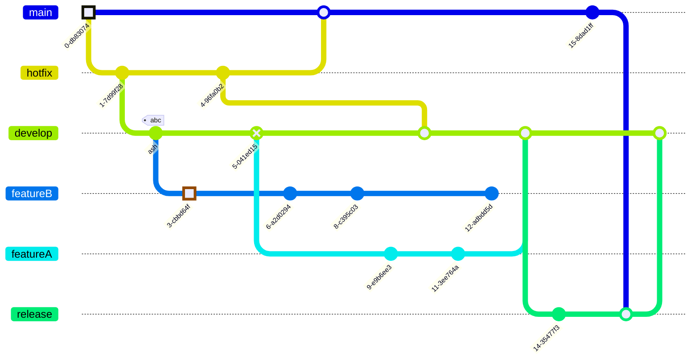
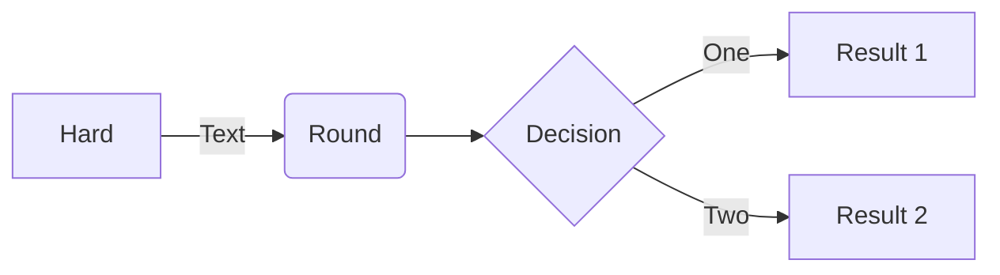
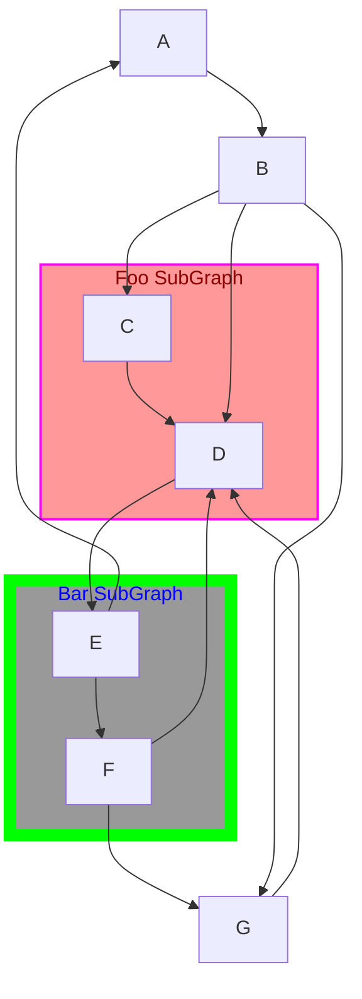
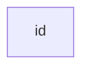
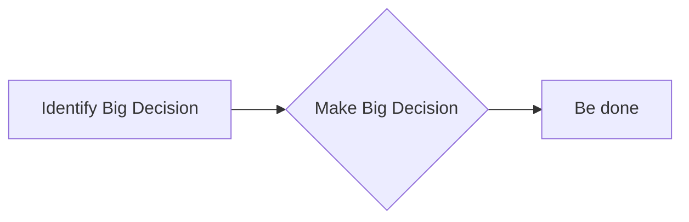
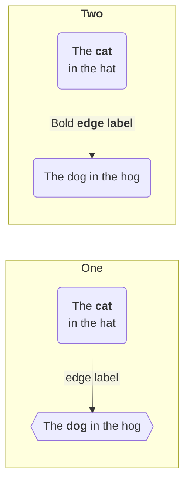

# Mermaid.js Snippets (v10.7.0, via context7)

Ниже собраны фрагменты официальных примеров Mermaid.js (v10.7.0), полученные через context7. Они могут использоваться как контекст при генерации и доработке диаграмм.

---

## Git graph (default theme)

---

## Flowchart: базовый синтаксис

---

## Flowchart: subgraph и стиль

---

## Flowchart: простой пример

---

## Accessibility: accTitle / accDescr

---

## Flowchart: markdown-строки в лейблах

